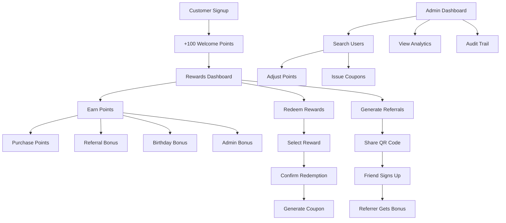

# Broski's Kitchen Rewards MVP - Product Requirements Document

## 1. Product Overview

Broski's Kitchen Rewards MVP is a comprehensive loyalty and rewards system that gamifies customer engagement through points, tiers, referrals, and redemptions. The system integrates seamlessly with the existing Next.js + Firebase + Vercel stack to provide both customer-facing rewards experiences and powerful admin management tools.

The rewards system addresses customer retention challenges by incentivizing repeat purchases, referrals, and engagement while providing restaurant operators with detailed analytics and flexible reward management capabilities.

## 2. Core Features

### 2.1 User Roles

| Role | Registration Method | Core Permissions |
|------|---------------------|------------------|
| Customer | Email/phone registration | Can earn points, redeem rewards, view transaction history, generate referral codes |
| Admin | Admin claim assignment | Can adjust user points, issue manual coupons, view analytics, manage reward rules |

### 2.2 Feature Module

Our Broski's Kitchen Rewards MVP consists of the following main pages:

1. **Customer Rewards Dashboard**: Points balance display, tier progress visualization, transaction history, redemption interface
2. **Admin Rewards Management**: User search and point adjustment, manual coupon issuance, analytics dashboard, audit trail
3. **Referral System**: QR code generation, referral tracking, bonus distribution
4. **Redemption Interface**: Available rewards catalog, confirmation modals, coupon generation

### 2.3 Page Details

| Page Name | Module Name | Feature description |
|-----------|-------------|---------------------|
| Customer Rewards Dashboard | Points Display | Show current points balance, lifetime points, and tier status with visual progress indicators |
| Customer Rewards Dashboard | Tier Progress | Display progress ring to next tier with multiplier benefits and tier-up confetti animations |
| Customer Rewards Dashboard | Transaction History | List all point earning and redemption transactions with timestamps and reasons |
| Customer Rewards Dashboard | Redemption Interface | Browse available rewards, select redemption options, confirm purchases with modal dialogs |
| Customer Rewards Dashboard | Referral System | Generate unique referral codes, display QR codes, track referral bonuses |
| Admin Rewards Management | User Search | Search customers by email or phone number for point management |
| Admin Rewards Management | Point Adjustment | Add points with preset buttons (+100/+500/+1000) or custom amounts |
| Admin Rewards Management | Manual Coupons | Issue single-use discount coupons directly to customers |
| Admin Rewards Management | Analytics Dashboard | View total points issued, redemptions, tier distribution, and system metrics |
| Admin Rewards Management | Audit Trail | Track all admin actions with timestamps and responsible admin identification |

## 3. Core Process

**Customer Flow:**
1. Customer signs up and receives 100 welcome points
2. Customer earns points through purchases, referrals, and special events
3. Customer views points balance and tier progress on rewards dashboard
4. Customer redeems points for discount coupons
5. Customer uses generated coupon codes at checkout
6. Customer shares referral code to earn bonus points

**Admin Flow:**
1. Admin accesses rewards management dashboard
2. Admin searches for specific customers by email/phone
3. Admin adjusts customer points for catering orders or special circumstances
4. Admin issues manual discount coupons
5. Admin reviews analytics and audit trails
6. Admin manages reward rules and promotional campaigns

## 4. User Interface Design

### 4.1 Design Style

- **Primary Colors**: Deep black (#000000) backgrounds with gold accent (#FFD700) for premium feel
- **Secondary Colors**: White text (#FFFFFF) with gray variants (#888888, #CCCCCC) for hierarchy
- **Button Style**: Rounded corners with gradient effects, hover animations, and clear call-to-action styling
- **Font**: Modern sans-serif with clear hierarchy - headings in bold, body text in regular weight
- **Layout Style**: Card-based design with clean spacing, mobile-first responsive approach
- **Icons**: Minimalist line icons with gold accents, reward-themed iconography (stars, crowns, gift boxes)

### 4.2 Page Design Overview

| Page Name | Module Name | UI Elements |
|-----------|-------------|-------------|
| Customer Rewards Dashboard | Points Display | Large prominent point balance with gold styling, tier badge with crown icon, lifetime points counter |
| Customer Rewards Dashboard | Tier Progress | Circular progress ring with animated fill, next tier preview, multiplier benefit callouts |
| Customer Rewards Dashboard | Transaction History | Clean table with alternating row colors, transaction type icons, date formatting |
| Customer Rewards Dashboard | Redemption Interface | Grid layout of reward cards, modal overlays for confirmation, success animations |
| Customer Rewards Dashboard | Referral System | QR code display with copy-to-clipboard functionality, referral stats, social sharing buttons |
| Admin Rewards Management | User Search | Search bar with autocomplete, user result cards with quick action buttons |
| Admin Rewards Management | Point Adjustment | Preset amount buttons with hover effects, custom input field, confirmation dialogs |
| Admin Rewards Management | Analytics Dashboard | Chart visualizations, metric cards with trend indicators, export functionality |

### 4.3 Responsiveness

The rewards system is designed mobile-first with adaptive layouts for desktop users. Touch interactions are optimized for mobile redemption flows, with larger tap targets and swipe gestures for navigation. The admin dashboard prioritizes desktop experience while maintaining mobile accessibility for on-the-go management.