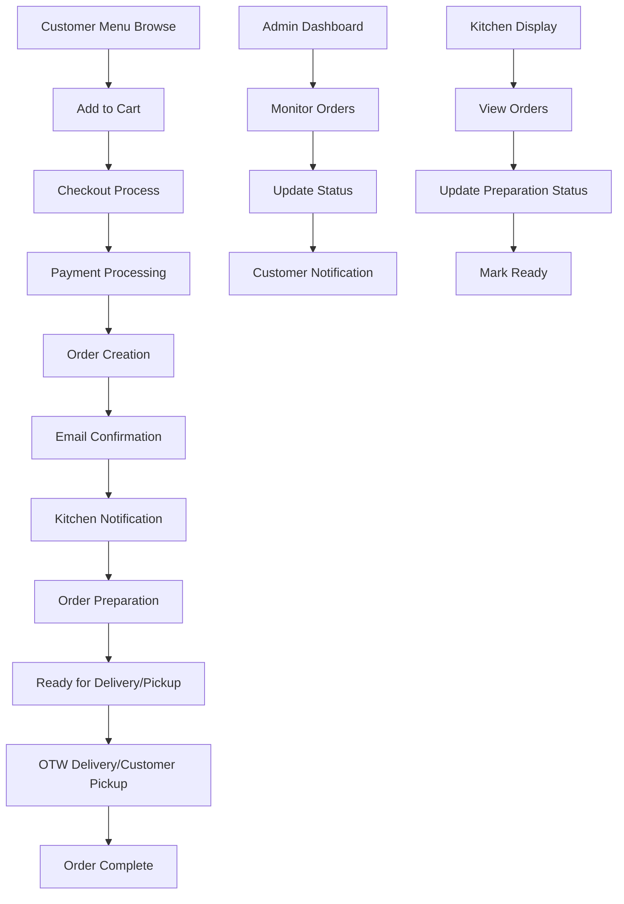

# Real Order Implementation Guide
## Broski's Kitchen - Complete Order Processing System

## 1. Product Overview
Implement a complete real-time order processing system for Broski's Kitchen that connects existing infrastructure components (Stripe, Firebase, APIs) to enable customers to place actual orders with payment processing, order tracking, and comprehensive management capabilities.

This system will transform the current mock-based checkout into a fully functional e-commerce ordering platform with real payment processing, order fulfillment tracking, customer notifications, and administrative management tools.

## 2. Core Features

### 2.1 User Roles
| Role | Registration Method | Core Permissions |
|------|---------------------|------------------|
| Customer | Email/Google registration | Place orders, track orders, manage payment methods, view order history |
| Admin | Admin invitation/promotion | Manage all orders, update order status, view analytics, manage menu items |
| Kitchen Staff | Staff account creation | View incoming orders, update preparation status, mark orders ready |

### 2.2 Feature Module
Our real order implementation consists of the following main components:
1. **Real-time Order Processing**: Payment integration, order validation, inventory checking
2. **Order Management Dashboard**: Customer order tracking, admin order management, kitchen workflow
3. **Payment & Billing System**: Stripe integration, receipt generation, refund processing
4. **Notification System**: Email confirmations, SMS updates, real-time status notifications
5. **Delivery Integration**: OTW service integration, tracking, driver coordination
6. **Analytics & Reporting**: Order analytics, revenue tracking, performance metrics

### 2.3 Page Details
| Page Name | Module Name | Feature description |
|-----------|-------------|---------------------|
| Checkout Page | Order Processing | Connect existing checkout flow to real APIs, validate cart items, process payments through Stripe, create orders in Firebase |
| Order Confirmation | Receipt Generation | Generate order receipts, send confirmation emails, display order tracking information, integrate with OTW delivery |
| Order Tracking | Real-time Updates | Live order status tracking, estimated delivery times, driver location (OTW integration), order modification options |
| Order History | Customer Management | Display past orders with details, reorder functionality, download receipts, track refunds and cancellations |
| Admin Dashboard | Order Management | View all orders in real-time, update order status, manage refunds, view order analytics and reports |
| Kitchen Display | Order Workflow | Kitchen staff interface for viewing incoming orders, updating preparation status, managing order queue |
| Payment Management | Billing System | Manage payment methods, process refunds, handle failed payments, update billing information |

## 3. Core Process

### Customer Order Flow
1. **Menu Selection**: Customer browses menu, adds items to cart with customizations
2. **Checkout Process**: Customer proceeds to checkout, selects delivery/pickup, enters payment info
3. **Payment Processing**: Stripe processes payment, creates payment intent, handles 3D Secure if needed
4. **Order Creation**: Successful payment triggers order creation in Firebase with unique order ID
5. **Confirmation**: Customer receives email confirmation and order tracking information
6. **Order Tracking**: Customer can track order status in real-time through order tracking page
7. **Fulfillment**: Order is prepared by kitchen staff and delivered via OTW or ready for pickup

### Admin Order Management Flow
1. **Order Monitoring**: Admin views all incoming orders in real-time dashboard
2. **Status Updates**: Admin can update order status (confirmed, preparing, ready, delivered)
3. **Issue Resolution**: Handle customer complaints, process refunds, modify orders if needed
4. **Analytics Review**: Monitor order trends, revenue metrics, and performance indicators

## 4. User Interface Design

### 4.1 Design Style
- **Primary Colors**: Rich Black (#0A0A0A), Harvest Gold (#DAA520)
- **Secondary Colors**: Warm Gray (#2D2D2D), Success Green (#10B981), Error Red (#EF4444)
- **Button Style**: Rounded corners (8px), gradient hover effects, disabled states for processing
- **Typography**: Inter font family, 16px base size, bold headings, clear hierarchy
- **Layout Style**: Card-based design, responsive grid layout, sticky navigation, mobile-first approach
- **Icons**: Lucide React icons, consistent sizing, contextual colors

### 4.2 Page Design Overview
| Page Name | Module Name | UI Elements |
|-----------|-------------|-------------|
| Checkout Page | Payment Flow | Multi-step progress indicator, form validation states, loading spinners, secure payment badges, address autocomplete |
| Order Confirmation | Success State | Large checkmark icon, order summary cards, tracking number display, estimated delivery time, action buttons |
| Order Tracking | Live Updates | Progress timeline, real-time status badges, map integration (OTW), estimated time display, contact options |
| Admin Dashboard | Management Interface | Data tables with sorting/filtering, status dropdown selectors, bulk action buttons, analytics charts, search functionality |
| Kitchen Display | Workflow Interface | Order queue cards, timer displays, status toggle buttons, priority indicators, preparation checklists |

### 4.3 Responsiveness
Mobile-first responsive design with touch-optimized interactions. Desktop experience enhanced with hover states and keyboard navigation. Tablet layout optimized for kitchen staff workflow with larger touch targets.

## 5. Technical Implementation

### 5.1 API Integration Points
- **Order Creation**: `/api/orders` - Create new orders with validation
- **Payment Processing**: `/api/stripe/create-payment-intent` - Handle Stripe payments
- **Order Updates**: `/api/orders/[id]` - Update order status and details
- **OTW Integration**: `/api/otw/create-delivery` - Create delivery orders
- **Notifications**: `/api/notifications/send` - Send email/SMS notifications

### 5.2 Database Schema Updates
- **Orders Collection**: Add real-time listeners for status updates
- **Payment Records**: Link Stripe payment intents to orders
- **Delivery Tracking**: Store OTW delivery information
- **Notification Logs**: Track sent notifications and delivery status

### 5.3 Environment Configuration
Required environment variables:
- `STRIPE_SECRET_KEY` - Stripe payment processing
- `STRIPE_WEBHOOK_SECRET` - Webhook signature verification
- `OTW_API_KEY` - Delivery service integration
- `SENDGRID_API_KEY` - Email notifications
- `TWILIO_AUTH_TOKEN` - SMS notifications

### 5.4 Security Considerations
- Payment data handled exclusively by Stripe (PCI compliance)
- Order access restricted by user authentication
- Admin functions protected by role-based access control
- API endpoints secured with proper authentication middleware
- Webhook signatures verified for external integrations

## 6. Implementation Priority

### Phase 1: Core Order Processing (Week 1-2)
1. Connect checkout flow to real APIs
2. Implement Stripe payment processing
3. Create order records in Firebase
4. Basic email confirmations

### Phase 2: Order Management (Week 3-4)
1. Admin dashboard for order management
2. Kitchen display system
3. Order status updates and notifications
4. Customer order tracking

### Phase 3: Advanced Features (Week 5-6)
1. OTW delivery integration
2. Advanced analytics and reporting
3. Refund and cancellation handling
4. Performance optimization

## 7. Testing Strategy

### 7.1 Payment Testing
- Use Stripe test cards for payment flow validation
- Test failed payment scenarios and error handling
- Verify webhook processing and order status updates

### 7.2 Order Flow Testing
- End-to-end order placement and fulfillment
- Real-time status update verification
- Notification delivery testing
- Mobile and desktop checkout experience

### 7.3 Integration Testing
- OTW delivery service integration
- Firebase real-time updates
- Email and SMS notification delivery
- Admin dashboard functionality

This implementation will transform Broski's Kitchen from a demo application into a fully functional restaurant ordering platform capable of processing real customer orders with complete payment processing, order management, and delivery coordination.