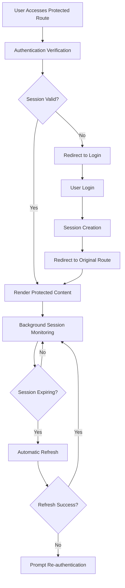

# Robust Authentication Verification System - Product Requirements Document

## 1. Product Overview

Broski's Kitchen requires a bulletproof authentication verification system that ensures users can seamlessly access protected features while maintaining the highest security standards. The system must eliminate authentication-related user experience issues such as unexpected redirects, loading loops, and session inconsistencies.

The enhanced authentication system will provide users with a smooth, secure experience when accessing their dashboard, profile, orders, and other protected features, while preventing unauthorized access and maintaining session integrity across all application interactions.

## 2. Core Features

### 2.1 User Roles

| Role | Registration Method | Core Permissions |
|------|---------------------|------------------|
| Customer | Email/password or Google OAuth | Access to dashboard, profile, orders, cart, checkout |
| Premium Customer | Upgrade through loyalty program | All customer permissions + exclusive rewards |
| Admin | Manual assignment by system admin | Full system access + administrative functions |

### 2.2 Feature Module

Our robust authentication system consists of the following main components:

1. **Enhanced Login Experience**: Seamless authentication with comprehensive verification and clear feedback
2. **Protected Route Access**: Secure access to user dashboard, profile, orders, and other sensitive areas
3. **Session Management**: Reliable session handling with automatic refresh and security monitoring
4. **Security Dashboard**: Real-time authentication status and security event monitoring
5. **Error Recovery**: Graceful error handling with clear user guidance and recovery options

### 2.3 Page Details

| Page Name | Module Name | Feature description |
|-----------|-------------|---------------------|
| Login Page | Authentication Form | Email/password login, Google OAuth, remember me option, forgot password link, clear error messages |
| Login Page | Security Verification | Rate limiting protection, CSRF token validation, suspicious activity detection |
| Dashboard | Authentication Guard | Verify user session before rendering, display loading state during verification, redirect to login if unauthorized |
| Dashboard | User Welcome | Personalized greeting, session status indicator, last login timestamp |
| Profile Page | Access Control | Require email verification, validate session integrity, secure data access |
| Profile Page | Security Settings | Session management, login history, security notifications |
| Orders Page | Transaction Security | Verify user identity, validate order ownership, secure payment information access |
| Orders Page | Data Protection | Encrypted data transmission, secure order history display |
| Cart Page | Session Persistence | Maintain cart state across sessions, secure checkout preparation |
| Checkout Page | Enhanced Security | Multi-factor verification for high-value orders, secure payment processing |
| Security Dashboard | Session Monitoring | Active sessions display, login history, security alerts |
| Security Dashboard | Account Protection | Suspicious activity alerts, security recommendations, account lockout status |
| Error Recovery | Authentication Errors | Clear error messages, guided recovery steps, support contact options |
| Error Recovery | Session Issues | Automatic session refresh, manual re-authentication, data preservation |

## 3. Core Process

### Customer Authentication Flow

1. **Initial Access**: User visits protected route (dashboard, profile, orders)
2. **Authentication Check**: System verifies session cookie and user authentication status
3. **Loading State**: Display authentication verification loading indicator
4. **Verification Complete**: 
   - If authenticated: Render requested protected content
   - If not authenticated: Redirect to login page with return URL
5. **Login Process**: User enters credentials or uses Google OAuth
6. **Session Creation**: System creates secure session cookie and updates authentication state
7. **Redirect to Destination**: User is redirected to originally requested page
8. **Protected Content Access**: User can now access all protected features seamlessly

### Admin Authentication Flow

1. **Admin Login**: Enhanced security verification with additional checks
2. **Role Verification**: System validates admin permissions and access levels
3. **Security Monitoring**: All admin actions are logged and monitored
4. **Session Management**: Admin sessions have shorter timeout periods for security

### Session Refresh Flow

1. **Background Monitoring**: System monitors session expiration in background
2. **Automatic Refresh**: Sessions are refreshed automatically before expiration
3. **User Notification**: Users are notified of session status changes
4. **Graceful Degradation**: If refresh fails, user is guided through re-authentication

## 4. User Interface Design

### 4.1 Design Style

- **Primary Colors**: Black (#000000) background, Gold (#FFD700) accents
- **Secondary Colors**: White (#FFFFFF) text, Gray (#6B7280) secondary text, Red (#EF4444) errors
- **Button Style**: Rounded corners (8px), hover animations, clear focus states
- **Font**: Montserrat for UI elements, Playfair Display for headings, 16px base size
- **Layout Style**: Card-based design with subtle shadows, top navigation, responsive grid
- **Loading Indicators**: Spinning gold circles, skeleton screens for content, progress bars for multi-step processes
- **Error States**: Clear red error messages with actionable recovery options

### 4.2 Page Design Overview

| Page Name | Module Name | UI Elements |
|-----------|-------------|-------------|
| Login Page | Authentication Form | Centered card layout, gold accent buttons, clear input fields with validation states, Google OAuth button with brand colors |
| Login Page | Loading States | Spinning indicator during authentication, disabled form during processing, progress feedback |
| Dashboard | Authentication Guard | Full-screen loading overlay with Broski's Kitchen branding, smooth fade-in animation |
| Dashboard | Security Indicator | Small green/yellow/red dot showing session status, tooltip with details |
| Profile Page | Security Section | Card-based layout for security settings, clear action buttons, status indicators |
| Orders Page | Access Control | Secure badge indicators, encrypted data symbols, loading skeletons for order data |
| Security Dashboard | Monitoring Panel | Dark theme dashboard, real-time status indicators, color-coded alerts |
| Error Recovery | Error Messages | Clear red error cards, step-by-step recovery instructions, prominent retry buttons |

### 4.3 Responsiveness

The authentication system is mobile-first with adaptive design:
- **Desktop**: Full-featured interface with detailed security information
- **Tablet**: Optimized layout with touch-friendly controls
- **Mobile**: Streamlined interface focusing on essential authentication features
- **Touch Optimization**: Large touch targets, swipe gestures for navigation, haptic feedback for important actions

## 5. Security Requirements

### 5.1 Authentication Security

- **Password Requirements**: Minimum 8 characters, complexity validation, breach detection
- **Session Security**: HTTP-only cookies, secure transmission, automatic expiration
- **Rate Limiting**: Maximum 5 login attempts per 15 minutes per IP address
- **CSRF Protection**: Token validation for all authentication requests

### 5.2 Data Protection

- **Encryption**: All sensitive data encrypted in transit and at rest
- **Session Isolation**: Each user session is completely isolated from others
- **Audit Logging**: All authentication events logged for security monitoring
- **Privacy Compliance**: GDPR-compliant data handling and user consent management

## 6. Performance Requirements

### 6.1 Response Times

- **Authentication Verification**: < 200ms for session validation
- **Login Process**: < 2 seconds for credential verification
- **Page Load**: < 1 second for protected content after authentication
- **Session Refresh**: < 500ms for background session updates

### 6.2 Availability

- **Uptime**: 99.9% availability for authentication services
- **Fallback**: Graceful degradation when authentication services are unavailable
- **Recovery**: Automatic recovery from temporary authentication failures

## 7. User Experience Requirements

### 7.1 Loading States

- **Clear Feedback**: Users always know when authentication is being verified
- **Progress Indicators**: Visual feedback for multi-step authentication processes
- **Timeout Handling**: Clear messaging when authentication takes longer than expected

### 7.2 Error Handling

- **User-Friendly Messages**: Technical errors translated to clear, actionable user messages
- **Recovery Guidance**: Step-by-step instructions for resolving authentication issues
- **Support Integration**: Easy access to help and support when authentication fails

### 7.3 Accessibility

- **Screen Reader Support**: Full compatibility with assistive technologies
- **Keyboard Navigation**: Complete keyboard accessibility for all authentication features
- **Color Contrast**: WCAG 2.1 AA compliant color schemes for all authentication UI elements
- **Focus Management**: Clear focus indicators and logical tab order

## 8. Success Metrics

### 8.1 User Experience Metrics

- **Authentication Success Rate**: > 99% successful login attempts
- **Session Continuity**: < 0.1% unexpected session terminations
- **User Satisfaction**: > 4.5/5 rating for authentication experience
- **Support Tickets**: < 2% of users require authentication support

### 8.2 Security Metrics

- **Failed Attack Prevention**: 100% prevention of common authentication attacks
- **Session Security**: Zero session hijacking incidents
- **Data Breach Prevention**: Zero unauthorized access to protected user data
- **Compliance**: 100% compliance with security and privacy regulations

### 8.3 Performance Metrics

- **Page Load Speed**: < 1 second average load time for protected pages
- **Authentication Speed**: < 500ms average authentication verification time
- **System Availability**: > 99.9% uptime for authentication services
- **Error Recovery**: < 5 seconds average time to recover from authentication errors

This robust authentication verification system ensures that Broski's Kitchen users have a secure, seamless, and reliable experience when accessing their accounts and protected features, while maintaining the highest standards of security and performance.