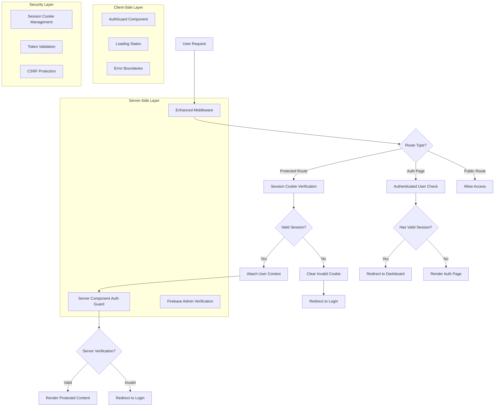

# Robust Authentication Verification Technical Architecture

## 1. Architecture Design



## 2. Technology Description

- **Frontend**: React@18 + Next.js@14 + TypeScript
- **Authentication**: Firebase Auth + Firebase Admin SDK
- **Session Management**: HTTP-only cookies with Firebase session cookies
- **Middleware**: Next.js Edge Runtime middleware
- **State Management**: React Context + Custom hooks
- **Security**: CSRF protection, secure cookies, token validation

## 3. Route Definitions

| Route | Purpose | Protection Level |
|-------|---------|------------------|
| /dashboard | User dashboard with KPIs and quick actions | Authenticated + Email Verified |
| /profile | User profile management | Authenticated + Email Verified |
| /orders | Order history and tracking | Authenticated + Email Verified |
| /loyalty | Loyalty program dashboard | Authenticated + Email Verified |
| /rewards | Rewards management | Authenticated + Email Verified |
| /cart | Shopping cart | Authenticated |
| /checkout | Order checkout process | Authenticated + Email Verified |
| /auth/login | User login page | Redirect if authenticated |
| /auth/signup | User registration page | Redirect if authenticated |
| /login | Alternative login route | Redirect if authenticated |

## 4. Enhanced Authentication Components

### 4.1 Enhanced Middleware Implementation

```typescript
// Enhanced middleware with comprehensive verification
export async function middleware(req: NextRequest) {
  const url = req.nextUrl;
  const response = NextResponse.next();
  
  // Performance optimization: Set cache headers
  if (isProtectedRoute(url.pathname) || isAuthRoute(url.pathname)) {
    response.headers.set("Cache-Control", "no-store, private, max-age=0");
  }
  
  const authResult = await verifyAuthentication(req);
  
  if (isProtectedRoute(url.pathname)) {
    return handleProtectedRoute(req, response, authResult);
  }
  
  if (isAuthRoute(url.pathname)) {
    return handleAuthRoute(req, response, authResult);
  }
  
  return response;
}

interface AuthResult {
  isAuthenticated: boolean;
  user?: SessionUser;
  sessionValid: boolean;
  emailVerified: boolean;
}

async function verifyAuthentication(req: NextRequest): Promise<AuthResult> {
  const sessionCookie = req.cookies.get('__session')?.value;
  
  if (!sessionCookie) {
    return { isAuthenticated: false, sessionValid: false, emailVerified: false };
  }
  
  try {
    // Edge-compatible JWT validation
    const payload = await validateJWTStructure(sessionCookie);
    const now = Math.floor(Date.now() / 1000);
    
    if (!payload.exp || payload.exp <= now || !payload.uid) {
      return { isAuthenticated: false, sessionValid: false, emailVerified: false };
    }
    
    return {
      isAuthenticated: true,
      sessionValid: true,
      emailVerified: payload.email_verified || false,
      user: {
        uid: payload.uid,
        email: payload.email,
        emailVerified: payload.email_verified || false,
        role: payload.role || 'customer'
      }
    };
  } catch (error) {
    return { isAuthenticated: false, sessionValid: false, emailVerified: false };
  }
}
```

### 4.2 Server-Side Authentication Guard

```typescript
// Enhanced server-side authentication verification
export async function withAuthGuard<T>(
  handler: (user: SessionUser) => Promise<T>,
  options: AuthGuardOptions = {}
): Promise<T> {
  const { requireEmailVerification = true, allowedRoles = [] } = options;
  
  try {
    const user = await getSessionCookie();
    
    if (!user) {
      redirect('/auth/login?error=authentication_required');
    }
    
    if (requireEmailVerification && !user.emailVerified) {
      redirect('/auth/verify-email?error=email_verification_required');
    }
    
    if (allowedRoles.length > 0 && !allowedRoles.includes(user.role)) {
      redirect('/403?error=insufficient_permissions');
    }
    
    return await handler(user);
  } catch (error) {
    console.error('Authentication guard error:', error);
    redirect('/auth/login?error=authentication_failed');
  }
}

interface AuthGuardOptions {
  requireEmailVerification?: boolean;
  allowedRoles?: string[];
}
```

### 4.3 Client-Side Authentication Guard Component

```typescript
// Client-side authentication guard with loading states
export function AuthGuard({ 
  children, 
  fallback, 
  requireEmailVerification = true 
}: AuthGuardProps) {
  const { user, isLoading, isAuthenticated } = useAuth();
  const [verificationComplete, setVerificationComplete] = useState(false);
  const router = useRouter();
  
  useEffect(() => {
    let mounted = true;
    
    const verifyAuth = async () => {
      if (isLoading) return;
      
      if (!isAuthenticated || !user) {
        if (mounted) {
          router.push('/auth/login?error=authentication_required');
        }
        return;
      }
      
      if (requireEmailVerification && !user.emailVerified) {
        if (mounted) {
          router.push('/auth/verify-email?error=email_verification_required');
        }
        return;
      }
      
      if (mounted) {
        setVerificationComplete(true);
      }
    };
    
    verifyAuth();
    
    return () => {
      mounted = false;
    };
  }, [isLoading, isAuthenticated, user, requireEmailVerification, router]);
  
  if (isLoading || !verificationComplete) {
    return fallback || <AuthLoadingState />;
  }
  
  if (!isAuthenticated || !user) {
    return null; // Router will handle redirect
  }
  
  if (requireEmailVerification && !user.emailVerified) {
    return null; // Router will handle redirect
  }
  
  return <>{children}</>;
}
```

## 5. Enhanced Session Management

### 5.1 Improved Session Cookie Implementation

```typescript
// Enhanced session management with better error handling
export async function getSessionCookie(): Promise<SessionUser | null> {
  try {
    const cookieStore = await cookies();
    const sessionCookie = cookieStore.get('__session')?.value;
    
    if (!sessionCookie) {
      return null;
    }
    
    const { adminAuth } = await import('@/lib/firebase/admin');
    
    if (!adminAuth) {
      throw new Error('Firebase Admin not initialized');
    }
    
    // Verify session cookie with checkRevoked flag
    const decodedClaims = await adminAuth.verifySessionCookie(sessionCookie, true);
    
    // Additional security checks
    if (!decodedClaims.uid || !decodedClaims.email) {
      throw new Error('Invalid session claims');
    }
    
    const user: SessionUser = {
      uid: decodedClaims.uid,
      email: decodedClaims.email,
      emailVerified: decodedClaims.email_verified || false,
      name: decodedClaims.name || decodedClaims.email.split('@')[0],
      role: decodedClaims.role || 'customer',
      permissions: decodedClaims.permissions || []
    };
    
    return user;
  } catch (error) {
    console.error('Session verification failed:', error);
    
    // Clear invalid session cookie
    const cookieStore = await cookies();
    cookieStore.delete('__session');
    
    return null;
  }
}
```

### 5.2 Session Refresh Mechanism

```typescript
// Automatic session refresh for long-lived sessions
export class SessionManager {
  private static refreshTimer: NodeJS.Timeout | null = null;
  
  static async startSessionRefresh() {
    // Refresh session every 50 minutes (Firebase tokens expire in 1 hour)
    this.refreshTimer = setInterval(async () => {
      await this.refreshSession();
    }, 50 * 60 * 1000);
  }
  
  static async refreshSession(): Promise<boolean> {
    try {
      const auth = getAuth();
      const user = auth.currentUser;
      
      if (!user) return false;
      
      // Force token refresh
      const idToken = await user.getIdToken(true);
      
      // Update session cookie
      const response = await fetch('/api/session', {
        method: 'POST',
        headers: { 'Content-Type': 'application/json' },
        credentials: 'include',
        body: JSON.stringify({ idToken })
      });
      
      return response.ok;
    } catch (error) {
      console.error('Session refresh failed:', error);
      return false;
    }
  }
  
  static stopSessionRefresh() {
    if (this.refreshTimer) {
      clearInterval(this.refreshTimer);
      this.refreshTimer = null;
    }
  }
}
```

## 6. Loading States and Error Handling

### 6.1 Authentication Loading States

```typescript
// Comprehensive loading states for authentication
export function AuthLoadingState() {
  return (
    <div className="min-h-screen bg-black text-white flex items-center justify-center">
      <div className="text-center space-y-4">
        <div className="animate-spin rounded-full h-12 w-12 border-b-2 border-yellow-400 mx-auto"></div>
        <h2 className="text-xl font-semibold">Verifying Authentication</h2>
        <p className="text-gray-400">Please wait while we verify your session...</p>
      </div>
    </div>
  );
}

export function AuthErrorState({ error, retry }: AuthErrorStateProps) {
  return (
    <div className="min-h-screen bg-black text-white flex items-center justify-center">
      <div className="text-center space-y-4 max-w-md">
        <div className="text-red-400 text-6xl">⚠️</div>
        <h2 className="text-xl font-semibold">Authentication Error</h2>
        <p className="text-gray-400">{error}</p>
        <button 
          onClick={retry}
          className="bg-yellow-400 text-black px-6 py-2 rounded-lg hover:bg-yellow-500 transition-colors"
        >
          Try Again
        </button>
      </div>
    </div>
  );
}
```

### 6.2 Error Boundary for Authentication

```typescript
// Authentication-specific error boundary
export class AuthErrorBoundary extends Component<AuthErrorBoundaryProps, AuthErrorBoundaryState> {
  constructor(props: AuthErrorBoundaryProps) {
    super(props);
    this.state = { hasError: false, error: null };
  }
  
  static getDerivedStateFromError(error: Error): AuthErrorBoundaryState {
    return { hasError: true, error: error.message };
  }
  
  componentDidCatch(error: Error, errorInfo: ErrorInfo) {
    console.error('Authentication error:', error, errorInfo);
    
    // Log authentication errors for monitoring
    if (error.message.includes('auth') || error.message.includes('session')) {
      this.logAuthError(error, errorInfo);
    }
  }
  
  private logAuthError(error: Error, errorInfo: ErrorInfo) {
    // Send to monitoring service
    fetch('/api/monitoring/auth-error', {
      method: 'POST',
      headers: { 'Content-Type': 'application/json' },
      body: JSON.stringify({
        error: error.message,
        stack: error.stack,
        componentStack: errorInfo.componentStack,
        timestamp: new Date().toISOString()
      })
    }).catch(console.error);
  }
  
  render() {
    if (this.state.hasError) {
      return (
        <AuthErrorState 
          error={this.state.error || 'An authentication error occurred'}
          retry={() => this.setState({ hasError: false, error: null })}
        />
      );
    }
    
    return this.props.children;
  }
}
```

## 7. Performance Optimizations

### 7.1 Authentication State Caching

```typescript
// Optimized authentication state with caching
export function useOptimizedAuth() {
  const [authState, setAuthState] = useState<AuthState>(() => {
    // Initialize from sessionStorage if available
    if (typeof window !== 'undefined') {
      const cached = sessionStorage.getItem('auth_state');
      if (cached) {
        try {
          return JSON.parse(cached);
        } catch {
          // Ignore invalid cache
        }
      }
    }
    return { user: null, isLoading: true, isAuthenticated: false };
  });
  
  useEffect(() => {
    // Cache auth state in sessionStorage
    if (typeof window !== 'undefined') {
      sessionStorage.setItem('auth_state', JSON.stringify(authState));
    }
  }, [authState]);
  
  return authState;
}
```

### 7.2 Preload Authentication for Protected Routes

```typescript
// Preload authentication state for better UX
export function useAuthPreloader() {
  useEffect(() => {
    // Preload authentication state on app initialization
    const preloadAuth = async () => {
      try {
        const response = await fetch('/api/auth/session', {
          credentials: 'include',
          cache: 'no-store'
        });
        
        if (response.ok) {
          const user = await response.json();
          // Update auth context with preloaded data
          updateAuthContext(user);
        }
      } catch (error) {
        console.error('Auth preload failed:', error);
      }
    };
    
    preloadAuth();
  }, []);
}
```

## 8. Security Considerations

### 8.1 CSRF Protection

```typescript
// CSRF token validation for authentication endpoints
export function validateCSRFToken(req: NextRequest): boolean {
  const csrfToken = req.headers.get('x-csrf-token');
  const sessionToken = req.cookies.get('__session')?.value;
  
  if (!csrfToken || !sessionToken) {
    return false;
  }
  
  // Validate CSRF token against session
  return validateTokenPair(csrfToken, sessionToken);
}
```

### 8.2 Rate Limiting for Authentication

```typescript
// Rate limiting for authentication attempts
export class AuthRateLimiter {
  private static attempts = new Map<string, number>();
  private static lastAttempt = new Map<string, number>();
  
  static isRateLimited(identifier: string): boolean {
    const now = Date.now();
    const attempts = this.attempts.get(identifier) || 0;
    const lastAttempt = this.lastAttempt.get(identifier) || 0;
    
    // Reset counter after 15 minutes
    if (now - lastAttempt > 15 * 60 * 1000) {
      this.attempts.set(identifier, 0);
      return false;
    }
    
    // Allow max 5 attempts per 15 minutes
    return attempts >= 5;
  }
  
  static recordAttempt(identifier: string) {
    const attempts = this.attempts.get(identifier) || 0;
    this.attempts.set(identifier, attempts + 1);
    this.lastAttempt.set(identifier, Date.now());
  }
}
```

## 9. API Definitions

### 9.1 Session Management API

**Session Creation**
```
POST /api/session
```

Request:
| Param Name | Param Type | isRequired | Description |
|------------|------------|------------|-------------|
| idToken | string | true | Firebase ID token |

Response:
| Param Name | Param Type | Description |
|------------|------------|-------------|
| success | boolean | Operation status |
| user | SessionUser | User session data |

**Session Verification**
```
GET /api/session
```

Response:
| Param Name | Param Type | Description |
|------------|------------|-------------|
| user | SessionUser | Current user data |
| authenticated | boolean | Authentication status |

**Session Deletion**
```
DELETE /api/session
```

Response:
| Param Name | Param Type | Description |
|------------|------------|-------------|
| success | boolean | Logout status |

### 9.2 Authentication Status API

**Authentication Check**
```
GET /api/auth/status
```

Response:
| Param Name | Param Type | Description |
|------------|------------|-------------|
| authenticated | boolean | Authentication status |
| emailVerified | boolean | Email verification status |
| role | string | User role |
| permissions | string[] | User permissions |

## 10. Data Model

### 10.1 Session User Model

```typescript
interface SessionUser {
  uid: string;
  email: string;
  emailVerified: boolean;
  name?: string;
  role: string;
  permissions?: string[];
  lastLoginAt?: Date;
  sessionCreatedAt?: Date;
}

interface AuthState {
  user: SessionUser | null;
  isLoading: boolean;
  isAuthenticated: boolean;
  error?: string;
}

interface AuthContextType extends AuthState {
  login: (email: string, password: string) => Promise<boolean>;
  logout: () => Promise<void>;
  signInWithGoogle: () => Promise<boolean>;
  refreshSession: () => Promise<boolean>;
}
```

### 10.2 Authentication Events

```typescript
interface AuthEvent {
  type: 'login' | 'logout' | 'session_refresh' | 'auth_error';
  userId?: string;
  timestamp: Date;
  metadata?: Record<string, any>;
}

interface SecurityEvent {
  type: 'failed_login' | 'suspicious_activity' | 'session_hijack';
  identifier: string;
  timestamp: Date;
  details: Record<string, any>;
}
```

## 11. Implementation Checklist

### Phase 1: Core Authentication Enhancement
- [ ] Enhanced middleware with comprehensive verification
- [ ] Improved session cookie management
- [ ] Server-side authentication guards
- [ ] Client-side AuthGuard component

### Phase 2: Performance & UX
- [ ] Authentication state caching
- [ ] Loading states and error boundaries
- [ ] Session refresh mechanism
- [ ] Preload authentication for protected routes

### Phase 3: Security Hardening
- [ ] CSRF protection implementation
- [ ] Rate limiting for authentication
- [ ] Security event logging
- [ ] Session hijacking detection

### Phase 4: Monitoring & Analytics
- [ ] Authentication metrics collection
- [ ] Error monitoring and alerting
- [ ] Performance monitoring
- [ ] Security audit logging

This architecture provides a robust, secure, and performant authentication verification mechanism that ensures complete verification before rendering protected content while maintaining optimal user experience.