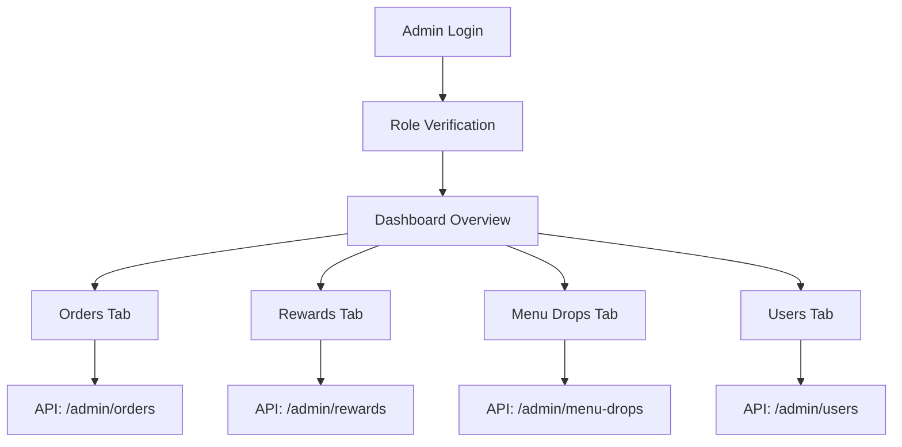

# Admin Dashboard Fix - Technical Requirements Document

## 1. Product Overview
Fix and complete the Admin Dashboard for Broski's Kitchen project to provide comprehensive administrative functionality with proper role-based access control and data aggregation from Firestore collections.

The solution addresses console errors, permission issues, and incomplete data fetching while ensuring TypeScript type safety and maintaining separation from cart/ordering functionality.

## 2. Core Features

### 2.1 User Roles
| Role | Registration Method | Core Permissions |
|------|---------------------|------------------|
| Admin | Manual role assignment | Full dashboard access, all CRUD operations |
| Manager | Admin-assigned upgrade | Dashboard read access, limited operations |
| Kitchen | Role-based assignment | Order management only |
| Customer | Standard registration | No admin access |

### 2.2 Feature Module
Our admin dashboard requirements consist of the following main pages:
1. **Overview Dashboard**: Real-time metrics, revenue tracking, user statistics, order summaries
2. **Orders Management**: Order listing, filtering, status updates, detailed views
3. **Rewards Management**: Points tracking, offer management, redemption analytics
4. **Menu Drops Management**: Drop performance, inventory tracking, revenue analysis
5. **User Management**: User listing, role management, loyalty statistics

### 2.3 Page Details
| Page Name | Module Name | Feature description |
|-----------|-------------|---------------------|
| Overview Dashboard | Metrics Banner | Display real-time totals for orders, revenue, active users, average order value |
| Overview Dashboard | Stats Overview | Show comprehensive statistics including total orders, revenue, active drops, user counts |
| Overview Dashboard | Recent Activity | List recent orders, top customers, user activity metrics |
| Orders Management | Order Listing | Fetch and display orders with pagination, filtering by status/date |
| Orders Management | Order Details | Show detailed order information, items, customer data |
| Rewards Management | Points Analytics | Track points issued, redeemed, active offers, total redemptions |
| Rewards Management | Top Performers | Display top redemptions and top customers by points |
| Menu Drops Management | Drop Performance | Show menu drop data, sales performance, revenue tracking |
| User Management | User Listing | Display users with role, loyalty stats, search functionality |
| User Management | Role Management | Update user roles, manage permissions |

## 3. Core Process
**Admin Flow:**
1. Admin logs in and role is verified (admin/manager)
2. Dashboard loads with real-time metrics from API routes
3. Admin navigates between tabs (Overview, Orders, Rewards, Menu Drops, Users)
4. Each tab fetches data from dedicated API endpoints
5. Admin can perform CRUD operations based on role permissions

**Data Flow:**
1. Frontend components call API routes instead of direct Firestore
2. API routes use Firebase Admin SDK for server-side data aggregation
3. Role-based access control enforced at API level
4. Real-time updates through SWR revalidation

## 4. User Interface Design
### 4.1 Design Style
- Primary colors: Blue (#3B82F6), Green (#10B981) for success states
- Secondary colors: Gray (#6B7280) for text, Red (#EF4444) for errors
- Button style: Rounded corners with hover effects
- Font: Inter, 14px base size, 16px for headers
- Layout style: Card-based design with top navigation tabs
- Icons: Heroicons for consistency

### 4.2 Page Design Overview
| Page Name | Module Name | UI Elements |
|-----------|-------------|-------------|
| Overview Dashboard | Metrics Cards | Grid layout with colored cards, real-time counters, trend indicators |
| Orders Management | Data Table | Sortable table with status badges, pagination controls, filter dropdowns |
| Rewards Management | Analytics Charts | Bar charts for redemptions, point distribution graphs |
| Menu Drops Management | Performance Grid | Card layout showing drop status, progress bars for sales |
| User Management | User Table | Avatar display, role badges, search input, action buttons |

### 4.3 Responsiveness
Desktop-first design with mobile-adaptive