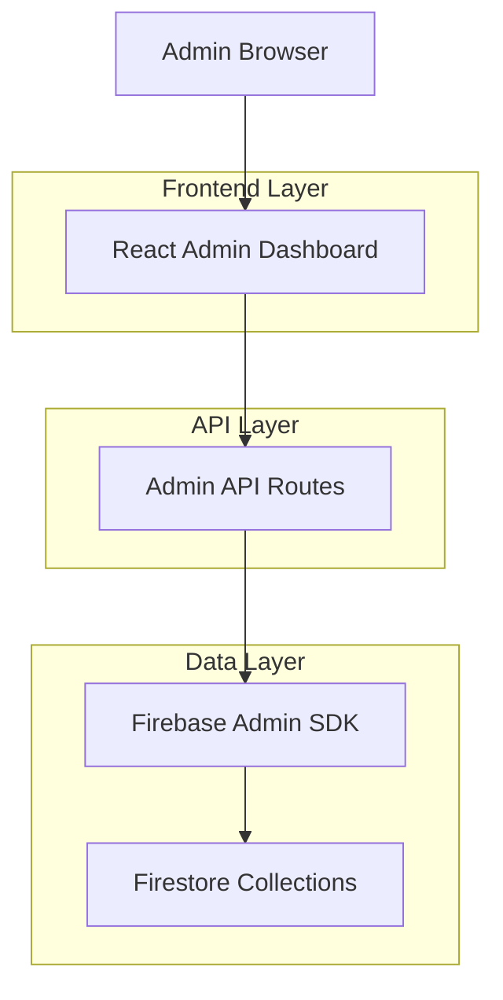
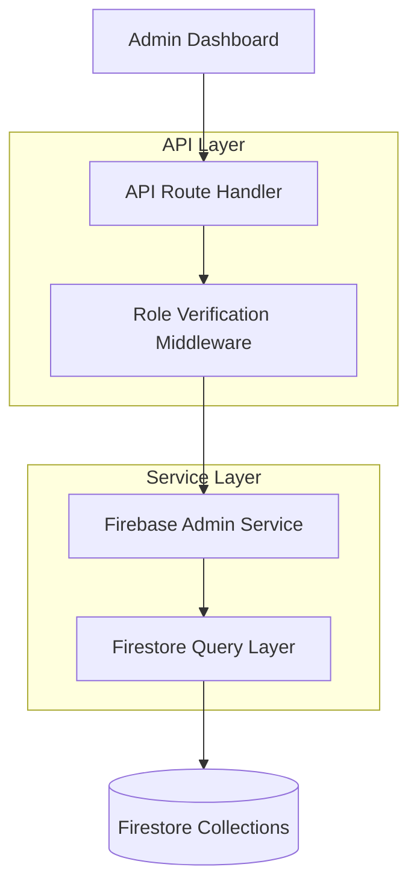
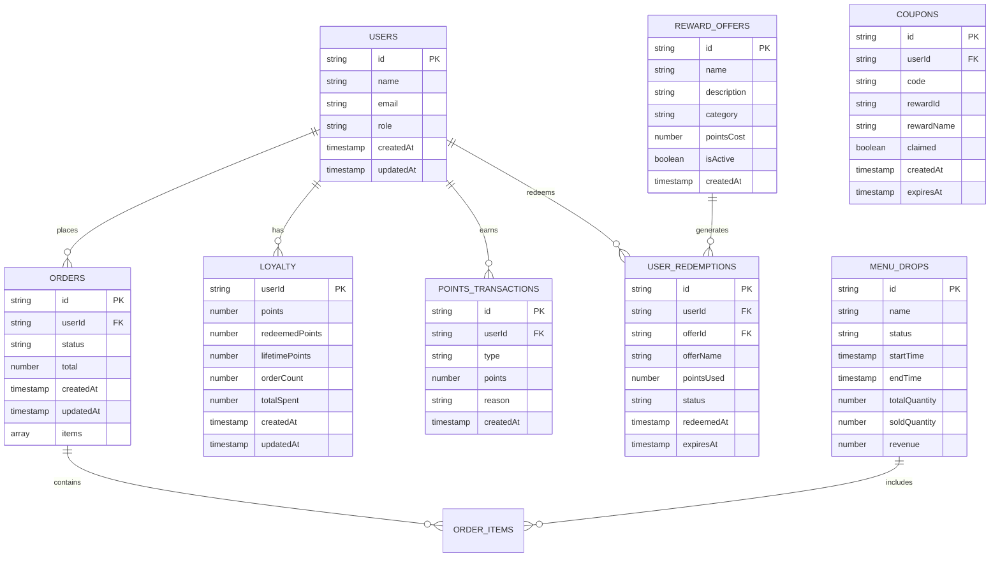

# Admin Dashboard Fix - Technical Architecture Document

## 1. Architecture Design



## 2. Technology Description

* Frontend: React\@18 + TypeScript + Tailwind CSS + SWR

* Backend: Next.js API Routes + Firebase Admin SDK

* Database: Firestore (existing collections)

* Authentication: Firebase Auth with role-based access

## 3. Route Definitions

| Route         | Purpose                                                 |
| ------------- | ------------------------------------------------------- |
| /admin        | Main admin dashboard with overview metrics              |
| /admin (tabs) | Tabbed interface for Orders, Rewards, Menu Drops, Users |

## 4. API Definitions

### 4.1 Core Admin APIs

**Admin Overview Metrics**

```
GET /api/admin/overview
```

Response:

| Param Name       | Param Type | Description                  |
| ---------------- | ---------- | ---------------------------- |
| totalOrders      | number     | Total number of orders       |
| totalRevenue     | number     | Total revenue amount         |
| activeDrops      | number     | Number of active menu drops  |
| totalUsers       | number     | Total registered users       |
| activeUsers      | number     | Users active in last 30 days |
| avgOrderValue    | number     | Average order value          |
| avgOrdersPerUser | number     | Average orders per user      |

**Admin Orders**

```
GET /api/admin/orders
```

Query Parameters:

| Param Name | Param Type | isRequired | Description                |
| ---------- | ---------- | ---------- | -------------------------- |
| status     | string     | false      | Filter by order status     |
| startDate  | string     | false      | Start date for filtering   |
| endDate    | string     | false      | End date for filtering     |
| limit      | number     | false      | Number of orders to return |
| cursor     | string     | false      | Pagination cursor          |

Response:

| Param Name | Param Type | Description               |
| ---------- | ---------- | ------------------------- |
| orders     | Order\[]   | Array of order objects    |
| hasMore    | boolean    | Whether more orders exist |
| nextCursor | string     | Cursor for next page      |

**Admin Rewards**

```
GET /api/admin/rewards
```

Response:

| Param Name       | Param Type        | Description              |
| ---------------- | ----------------- | ------------------------ |
| pointsIssued     | number            | Total points issued      |
| pointsRedeemed   | number            | Total points redeemed    |
| activeOffers     | number            | Number of active offers  |
| totalRedemptions | number            | Total redemptions count  |
| topRedemptions   | RedemptionStat\[] | Most popular redemptions |
| topCustomers     | CustomerStat\[]   | Top customers by points  |

**Admin Menu Drops**

```
GET /api/admin/menu-drops
```

Response:

| Param Name        | Param Type  | Description                |
| ----------------- | ----------- | -------------------------- |
| drops             | MenuDrop\[] | Array of menu drop objects |
| totalRevenue      | number      | Total revenue from drops   |
| avgSoldPercentage | number      | Average sold percentage    |

**Admin Users**

```
GET /api/admin/users
```

Query Parameters:

| Param Name | Param Type | isRequired | Description               |
| ---------- | ---------- | ---------- | ------------------------- |
| search     | string     | false      | Search by name or email   |
| role       | string     | false      | Filter by user role       |
| limit      | number     | false      | Number of users to return |
| cursor     | string     | false      | Pagination cursor         |

Response:

| Param Name | Param Type   | Description                              |
| ---------- | ------------ | ---------------------------------------- |
| users      | AdminUser\[] | Array of user objects with loyalty stats |
| hasMore    | boolean      | Whether more users exist                 |
| nextCursor | string       | Cursor for next page                     |

## 5. Server Architecture Diagram



## 6. Data Model

### 6.1 Data Model Definition



### 6.2 Data Definition Language

**User Type Update**

```typescript
// Update existing User interface
interface User {
  id: string;
  name: string;
  email: string;
  role: 'admin' | 'manager' | 'kitchen' | 'customer';
  createdAt: Timestamp;
  updatedAt: Timestamp;
}

// Admin-specific user data with loyalty stats
interface AdminUser extends User {
  loyaltyStats?: {
    points: number;
    redeemedPoints: number;
    lifetimePoints: number;
    orderCount: number;
    totalSpent: number;
  };
}
```

**API Response Types**

```typescript
interface AdminOverviewData {
  totalOrders: number;
  totalRevenue: number;
  activeDrops: number;
  totalUsers: number;
  activeUsers: number;
  avgOrderValue: number;
  avgOrdersPerUser: number;
}

interface AdminRewardsData {
  pointsIssued: number;
  pointsRedeemed: number;
  activeOffers: number;
  totalRedemptions: number;
  topRedemptions: RedemptionStat[];
  topCustomers: CustomerStat[];
}

interface RedemptionStat {
  offerName: string;
  count: number;
  totalPoints: number;
}

interface CustomerStat {
  userId: string;
  name: string;
  email: string;
  totalPoints: number;
  redemptionCount: number;
}
```

**Firestore Security Rules Update**

```javascript
// Add admin/manager access helper
function isAdminOrManager() {
  return request.auth != null && 
    (request.auth.token.role == 'admin' || request.auth.token.role == 'manager');
}

// Apply to relevant collections
match /orders/{orderId} {
  allow read: if isAdminOrManager();
}

match /loyalty/{userId} {
  allow read: if isAdminOrManager();
}

match /pointsTransactions/{transactionId} {
  allow read: if isAdminOrManager();
}

match /userRedemptions/{redemptionId} {
  allow read: if isAdminOrManager();
}

match /menuDrops/{dropId} {
  allow read: if isAdminOrManager();
}
```

