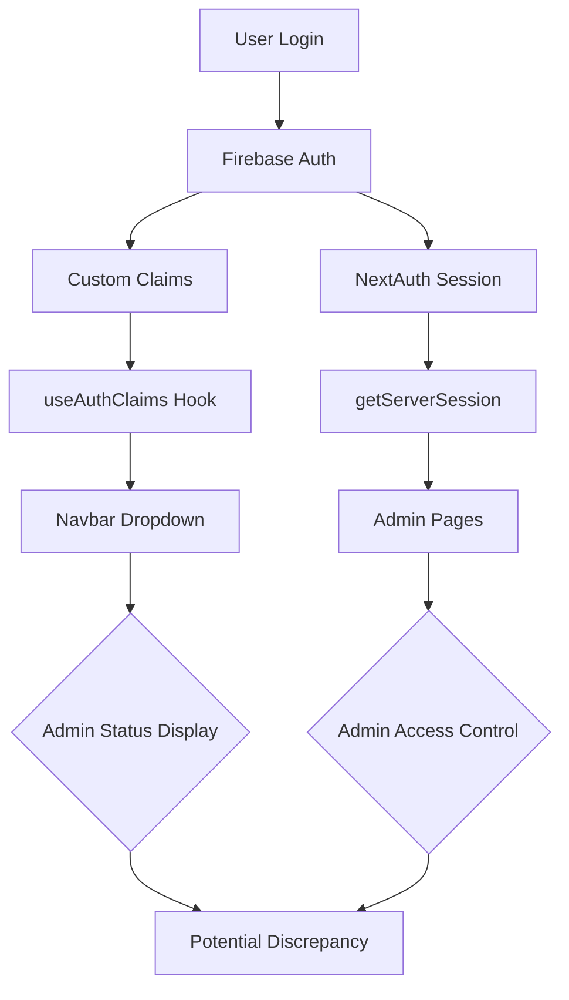

# Authentication Systems Analysis: User Dropdown vs Website Pages

## Executive Summary

This analysis examines the authentication systems used for the user dropdown component and website pages in Broski's Kitchen application. The investigation reveals **multiple parallel authentication systems** with different data sources, role verification methods, and caching mechanisms, leading to potential discrepancies in admin status reporting.

## 1. Authentication Mechanisms Overview

### 1.1 User Dropdown Component Authentication

**Primary System**: Firebase Authentication with Custom Claims
- **Location**: `<mcfile name="Navbar.tsx" path="/Users/carltonmayne/broskiskitchenfinal (5)/src/components/layout/Navbar.tsx"></mcfile>`
- **Hook**: `<mcsymbol name="useAuthClaims" filename="useAuthClaims.ts" path="/Users/carltonmayne/broskiskitchenfinal (5)/src/hooks/useAuthClaims.ts" startline="8" type="function"></mcsymbol>`
- **Mechanism**: Real-time Firebase ID token with custom claims
- **Data Source**: Firebase Auth ID token claims
- **Admin Check**: `claims?.admin` from Firebase custom claims

```typescript
// Navbar.tsx - Line 37
const { claims, loading } = useAuthClaims()

// Line 170-177
{!loading && claims?.admin && (
  <AccessibleMenuItem
    href="/admin"
    onClick={() => setUserDropdownOpen(false)}
    className="text-red-600 font-medium"
  >
    Admin
  </AccessibleMenuItem>
)}
```

### 1.2 Website Pages Authentication

**Primary System**: NextAuth.js with JWT Sessions
- **Location**: `<mcfile name="page.tsx" path="/Users/carltonmayne/broskiskitchenfinal (5)/src/app/admin/dashboard/page.tsx"></mcfile>`
- **Server Function**: `<mcsymbol name="getServerSession" filename="page.tsx" path="/Users/carltonmayne/broskiskitchenfinal (5)/src/app/admin/dashboard/page.tsx" startline="11" type="function"></mcsymbol>`
- **Mechanism**: Server-side session validation
- **Data Source**: NextAuth JWT token with role from allowed admin emails
- **Admin Check**: `(session as any)?.user?.role === "admin"`

```typescript
// Admin dashboard page.tsx - Line 11-16
async function getAdminSession() {
  const session = await getServerSession(authOptions as any);
  const isAdmin = (session as any)?.user?.role === "admin";
  if (!session || !isAdmin) {
    redirect("/login");
  }
  return session!;
}
```

## 2. Authentication System Architecture

### 2.1 Data Flow Diagram



### 2.2 Authentication Sources Comparison

| Component | Authentication Source | Role Determination | Caching | Real-time Updates |
|-----------|----------------------|-------------------|---------|-------------------|
| User Dropdown | Firebase Custom Claims | `claims?.admin` | Token-based | Yes (onIdTokenChanged) |
| Admin Pages | NextAuth JWT | `session.user.role` | Session-based | No (JWT only) |

## 3. Role Verification Methods Analysis

### 3.1 User Dropdown Role Verification

**Method**: Firebase Custom Claims via `useAuthClaims` hook
- **File**: `<mcfile name="useAuthClaims.ts" path="/Users/carltonmayne/broskiskitchenfinal (5)/src/hooks/useAuthClaims.ts"></mcfile>`
- **Process**: 
  1. Listens to `onIdTokenChanged` events
  2. Forces token refresh with `getIdTokenResult(true)`
  3. Extracts custom claims from token
  4. Checks `claims.admin` property

```typescript
// useAuthClaims.ts - Real-time updates
return onIdTokenChanged(auth, async (u) => {
  if (!u) {
    setUser(null)
    setClaims({})
    setLoading(false)
    return
  }

  // Force refresh to ensure custom claims are immediately available
  const tokenResult = await u.getIdTokenResult(true)
  setUser(u)
  setClaims(tokenResult.claims as Claims)
  setLoading(false)
})
```

### 3.2 Admin Pages Role Verification

**Method**: NextAuth JWT with server-side validation
- **File**: `<mcfile name="options.ts" path="/Users/carltonmayne/broskiskitchenfinal (5)/src/lib/auth/options.ts"></mcfile>`
- **Process**:
  1. Validates JWT token server-side
  2. Role determined by `ENV.ALLOWED_ADMIN_EMAILS.includes(email)`
  3. No real-time updates after initial JWT creation

```typescript
// auth/options.ts - JWT callback
async jwt({ token, user }) {
  const email = (user?.email || token?.email || "").toLowerCase();
  token.email = email;
  token.role = ENV.ALLOWED_ADMIN_EMAILS.includes(email) ? "admin" : "user";
  if (user?.id) {
    token.uid = user.id;
  }
  return token;
}
```

## 4. Identified Discrepancies

### 4.1 Data Source Mismatch

**Critical Issue**: Different role determination sources

| System | Role Source | Update Mechanism | Synchronization |
|--------|-------------|-------------------|-----------------|
| Firebase Claims | Custom claims via `setCustomUserClaims` | Real-time token refresh | Immediate |
| NextAuth | `ENV.ALLOWED_ADMIN_EMAILS` array | JWT creation only | Static |

### 4.2 Synchronization Issues

**Problem**: NextAuth role is set at JWT creation and never updated
- **Impact**: Admin elevation changes in Firebase don't reflect in NextAuth
- **Evidence**: NextAuth JWT callback only runs during initial authentication

### 4.3 Caching Inconsistencies

**User Dropdown**: Always fetches fresh Firebase token
**Admin Pages**: Uses cached JWT session data

## 5. Root Cause Analysis

### 5.1 Primary Issue: Parallel Authentication Systems

The application maintains **two separate authentication systems**:

1. **Firebase Authentication** with custom claims (real-time)
2. **NextAuth.js** with JWT sessions (static after creation)

### 5.2 Secondary Issues

1. **Role Definition Mismatch**:
   - Firebase: `customClaims.admin = true`
   - NextAuth: `ENV.ALLOWED_ADMIN_EMAILS.includes(email)`

2. **Update Mechanism Gap**:
   - Firebase: Immediate updates via `setCustomUserClaims`
   - NextAuth: No mechanism to refresh JWT role after elevation

3. **Data Source Divergence**:
   - User dropdown reads from Firebase custom claims
   - Admin pages read from NextAuth JWT

## 6. Evidence of Discrepancy

### 6.1 Code Evidence

**User Dropdown** (Real-time Firebase):
```typescript
// Uses Firebase custom claims directly
const { claims, loading } = useAuthClaims()
{!loading && claims?.admin && <AdminLink />}
```

**Admin Pages** (Static NextAuth):
```typescript
// Uses NextAuth JWT role (never updated after elevation)
const isAdmin = (session as any)?.user?.role === "admin";
```

### 6.2 Configuration Evidence

**NextAuth Role Determination**:
```typescript
// auth/options.ts - Only checks allowed emails, not Firebase claims
token.role = ENV.ALLOWED_ADMIN_EMAILS.includes(email) ? "admin" : "user";
```

## 7. Impact Assessment

### 7.1 User Experience Impact
- User sees admin link in dropdown but cannot access admin pages
- Admin elevation appears successful but doesn't grant actual access
- Inconsistent admin status reporting across application

### 7.2 Security Impact
- Potential privilege escalation bypass
- Inconsistent access control enforcement
- Audit trail inconsistencies

## 8. Recommendations

### 8.1 Immediate Fix: Synchronize Role Sources

**Option A**: Update NextAuth to use Firebase custom claims
```typescript
// Modify auth/options.ts JWT callback
async jwt({ token, user }) {
  // Fetch Firebase custom claims for real-time role
  const decodedToken = await adminAuth.verifyIdToken(firebaseIdToken);
  token.role = decodedToken.admin ? "admin" : "user";
  return token;
}
```

**Option B**: Create unified role resolution service
```typescript
// New service to resolve role from both sources
async function resolveUserRole(uid: string): Promise<string> {
  const firebaseClaims = await getFirebaseCustomClaims(uid);
  const nextAuthRole = await getNextAuthRole(uid);
  
  // Prefer Firebase claims for real-time accuracy
  return firebaseClaims?.admin ? "admin" : nextAuthRole;
}
```

### 8.2 Long-term Solution: Consolidate Authentication

**Recommended Approach**: Standardize on Firebase Authentication with custom claims
- Remove NextAuth role dependency
- Use Firebase as single source of truth
- Implement session management via Firebase

### 8.3 Implementation Priority

1. **High Priority**: Fix role synchronization in NextAuth JWT callback
2. **Medium Priority**: Add admin elevation to update both systems
3. **Low Priority**: Consider migrating to unified authentication system

## 9. Testing Strategy

### 9.1 Verification Tests
- Admin elevation should update both Firebase and NextAuth
- User dropdown and admin pages should show consistent admin status
- Role changes should be immediately reflected across all components

### 9.2 Monitoring
- Add logging for role resolution discrepancies
- Monitor authentication system performance
- Track admin elevation success rates

## 10. Conclusion

The authentication discrepancy is caused by **maintaining two parallel authentication systems** with different role determination methods and update mechanisms. The user dropdown uses real-time Firebase custom claims, while admin pages use static NextAuth JWT roles that are never updated after initial authentication.

**Root Cause**: NextAuth JWT role is determined at login and never refreshed, while Firebase custom claims can be updated in real-time via admin elevation.

**Solution**: Implement role synchronization between Firebase custom claims and NextAuth JWT, or standardize on a single authentication system.