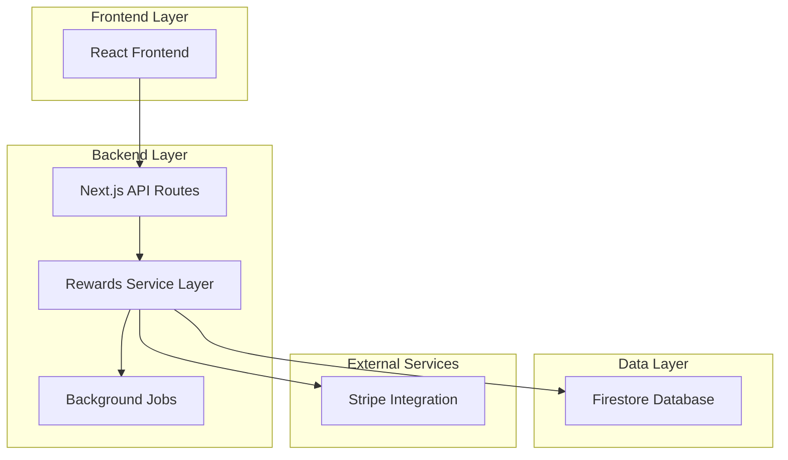
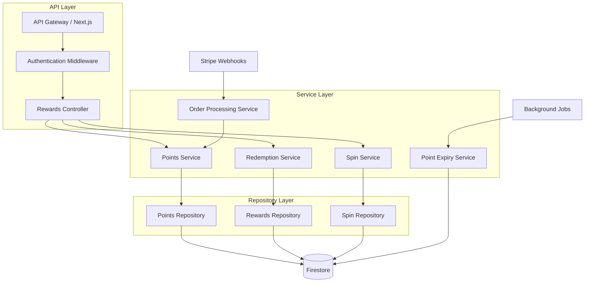
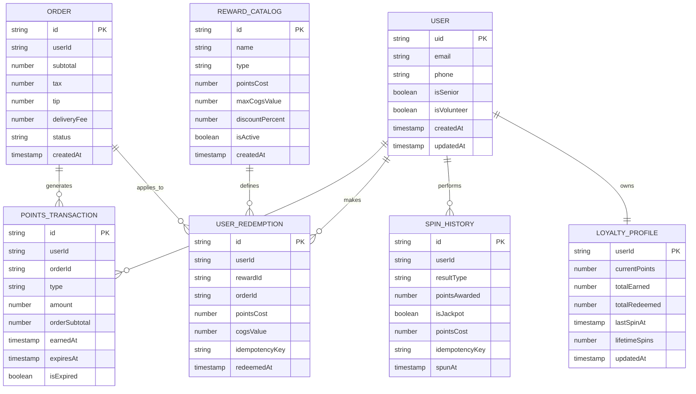

# Broski's Rewards Backend - Technical Architecture Document

## 1. Architecture Design



## 2. Technology Description

- Frontend: React@18 + Next.js@14 + TypeScript + Tailwind CSS
- Backend: Next.js API Routes + TypeScript
- Database: Firestore (Google Cloud)
- Authentication: Firebase Auth
- Payment Processing: Stripe
- Background Jobs: Vercel Cron + Cloud Functions
- Caching: Redis (optional for high-traffic scenarios)

## 3. Route Definitions

| Route | Purpose |
|-------|---------|
| /api/rewards/balance | Get user's current point balance and expiration details |
| /api/rewards/history | Retrieve user's points transaction history |
| /api/rewards/catalog | Fetch available rewards with COGS validation |
| /api/rewards/redeem | Redeem a reward with idempotency key |
| /api/rewards/spin | Execute daily spin wheel with cooldown check |
| /api/rewards/admin/analytics | Admin dashboard for giveback and profit metrics |
| /api/rewards/admin/users | Manage user tier status (senior, volunteer) |
| /api/rewards/webhooks/stripe | Process order completion for point accrual |

## 4. API Definitions

### 4.1 Core Rewards APIs

**Get User Balance**
```
GET /api/rewards/balance
```

Headers:
| Header Name | Type | Required | Description |
|-------------|------|----------|-------------|
| Authorization | string | true | Firebase JWT token |

Response:
| Param Name | Type | Description |
|------------|------|-------------|
| currentPoints | number | Available points balance |
| pendingPoints | number | Points pending from recent orders |
| expiringPoints | array | Points expiring in next 7 days |
| totalEarned | number | Lifetime points earned |
| totalRedeemed | number | Lifetime points redeemed |

Example Response:
```json
{
  "currentPoints": 245,
  "pendingPoints": 15,
  "expiringPoints": [
    {"amount": 50, "expiresAt": "2024-02-15T00:00:00Z"}
  ],
  "totalEarned": 1250,
  "totalRedeemed": 1005
}
```

**Redeem Reward**
```
POST /api/rewards/redeem
```

Request:
| Param Name | Type | Required | Description |
|------------|------|----------|-------------|
| rewardId | string | true | Unique reward identifier |
| orderId | string | true | Associated order ID |
| idempotencyKey | string | true | Unique key to prevent duplicate redemptions |

Response:
| Param Name | Type | Description |
|------------|------|-------------|
| success | boolean | Redemption status |
| pointsDeducted | number | Points removed from balance |
| rewardApplied | object | Details of applied reward |
| newBalance | number | Updated points balance |

Example Request:
```json
{
  "rewardId": "free-side-100",
  "orderId": "order_123",
  "idempotencyKey": "redemption_456"
}
```

**Spin Wheel**
```
POST /api/rewards/spin
```

Request:
| Param Name | Type | Required | Description |
|------------|------|----------|-------------|
| idempotencyKey | string | true | Unique key to prevent duplicate spins |

Response:
| Param Name | Type | Description |
|------------|------|-------------|
| success | boolean | Spin execution status |
| result | object | Spin result details |
| pointsAwarded | number | Bonus points received |
| nextSpinAvailable | string | ISO timestamp for next available spin |

Example Response:
```json
{
  "success": true,
  "result": {
    "type": "points",
    "value": 20,
    "isJackpot": false
  },
  "pointsAwarded": 20,
  "nextSpinAvailable": "2024-01-16T12:00:00Z"
}
```

## 5. Server Architecture Diagram



## 6. Data Model

### 6.1 Data Model Definition



### 6.2 Data Definition Language

**Loyalty Profiles Collection**
```javascript
// Collection: loyalty
// Document ID: {userId}
{
  userId: string,           // Firebase Auth UID
  currentPoints: number,    // Available points balance
  totalEarned: number,      // Lifetime points earned
  totalRedeemed: number,    // Lifetime points redeemed
  lastSpinAt: timestamp,    // Last spin wheel usage
  lifetimeSpins: number,    // Total spins performed
  tier: string,             // 'regular', 'senior', 'volunteer'
  createdAt: timestamp,
  updatedAt: timestamp
}

// Firestore Security Rules
GRANT SELECT ON loyalty TO authenticated WHERE userId == auth.uid;
GRANT ALL PRIVILEGES ON loyalty TO authenticated WHERE isAdminOrManager();
```

**Points Transactions Collection**
```javascript
// Collection: pointsTransactions
// Document ID: auto-generated
{
  id: string,               // Auto-generated document ID
  userId: string,           // Reference to user
  orderId: string,          // Associated order ID
  type: string,             // 'earned', 'redeemed', 'expired', 'bonus'
  amount: number,           // Points amount (positive for earned/bonus, negative for redeemed)
  orderSubtotal: number,    // Original order subtotal (for earned points)
  earnedAt: timestamp,      // When points were earned
  expiresAt: timestamp,     // 30 days from earnedAt
  isExpired: boolean,       // Expiry status flag
  metadata: object          // Additional context (spin result, reward details)
}

// Firestore Indexes
CREATE INDEX idx_points_user_earned ON pointsTransactions(userId, earnedAt DESC);
CREATE INDEX idx_points_expiry ON pointsTransactions(expiresAt ASC, isExpired);
CREATE INDEX idx_points_order ON pointsTransactions(orderId);
```

**User Redemptions Collection**
```javascript
// Collection: userRedemptions
// Document ID: auto-generated
{
  id: string,               // Auto-generated document ID
  userId: string,           // Reference to user
  rewardId: string,         // Reference to reward catalog
  orderId: string,          // Associated order ID
  pointsCost: number,       // Points deducted
  cogsValue: number,        // Actual COGS of redeemed item
  discountAmount: number,   // Dollar value of discount applied
  idempotencyKey: string,   // Unique key for duplicate prevention
  redeemedAt: timestamp,
  metadata: object          // Reward details snapshot
}

// Firestore Indexes
CREATE INDEX idx_redemptions_user ON userRedemptions(userId, redeemedAt DESC);
CREATE INDEX idx_redemptions_order ON userRedemptions(orderId);
CREATE INDEX idx_redemptions_idempotency ON userRedemptions(idempotencyKey);
```

**Reward Catalog Collection**
```javascript
// Collection: rewardCatalog
// Document ID: reward identifier
{
  id: string,               // Reward identifier (e.g., 'free-side-100')
  name: string,             // Display name
  description: string,      // Reward description
  type: string,             // 'fixed_item', 'percentage_discount', 'merchandise'
  pointsCost: number,       // Required points
  maxCogsValue: number,     // Maximum COGS allowed
  discountPercent: number,  // For percentage discounts
  category: string,         // 'food', 'merchandise'
  isActive: boolean,        // Availability status
  sortOrder: number,        // Display ordering
  createdAt: timestamp,
  updatedAt: timestamp
}

// Initial Reward Data
const initialRewards = [
  {
    id: 'free-side-100',
    name: 'Free Side',
    type: 'fixed_item',
    pointsCost: 100,
    maxCogsValue: 2.00,
    category: 'food',
    isActive: true,
    sortOrder: 1
  },
  {
    id: 'free-dessert-150',
    name: 'Free Dessert',
    type: 'fixed_item',
    pointsCost: 150,
    maxCogsValue: 4.00,
    category: 'food',
    isActive: true,
    sortOrder: 2
  },
  {
    id: 'discount-10-300',
    name: '10% Off Order',
    type: 'percentage_discount',
    pointsCost: 300,
    discountPercent: 10,
    category: 'food',
    isActive: true,
    sortOrder: 3
  },
  {
    id: 'free-burger-500',
    name: 'Free Burger',
    type: 'fixed_item',
    pointsCost: 500,
    maxCogsValue: 6.00,
    category: 'food',
    isActive: true,
    sortOrder: 4
  },
  {
    id: 'discount-20-700',
    name: '20% Off Order',
    type: 'percentage_discount',
    pointsCost: 700,
    discountPercent: 20,
    category: 'food',
    isActive: true,
    sortOrder: 5
  },
  {
    id: 'hat-400',
    name: 'Broski\'s Hat',
    type: 'merchandise',
    pointsCost: 400,
    maxCogsValue: 8.00,
    category: 'merchandise',
    isActive: true,
    sortOrder: 6
  },
  {
    id: 'shirt-600',
    name: 'Broski\'s T-Shirt',
    type: 'merchandise',
    pointsCost: 600,
    maxCogsValue: 12.00,
    category: 'merchandise',
    isActive: true,
    sortOrder: 7
  },
  {
    id: 'cookbook-1000',
    name: 'Broski\'s Cookbook',
    type: 'merchandise',
    pointsCost: 1000,
    maxCogsValue: 20.00,
    category: 'merchandise',
    isActive: true,
    sortOrder: 8
  }
];
```

**Spin History Collection**
```javascript
// Collection: spinHistory
// Document ID: auto-generated
{
  id: string,               // Auto-generated document ID
  userId: string,           // Reference to user
  resultType: string,       // 'points'
  pointsAwarded: number,    // Points received from spin
  isJackpot: boolean,       // Whether this was a jackpot win
  pointsCost: number,       // Points cost (5 for seniors, 0 for regular)
  idempotencyKey: string,   // Unique key for duplicate prevention
  spunAt: timestamp,
  wheelConfig: object       // Snapshot of wheel configuration
}

// Firestore Indexes
CREATE INDEX idx_spins_user ON spinHistory(userId, spunAt DESC);
CREATE INDEX idx_spins_jackpot ON spinHistory(isJackpot, spunAt DESC);
CREATE INDEX idx_spins_idempotency ON spinHistory(idempotencyKey);
```

## 7. Implementation Strategy

### 7.1 Migration Plan
1. **Phase 1**: Deploy new data schema alongside existing system
2. **Phase 2**: Implement point accrual and expiry background jobs
3. **Phase 3**: Launch spin wheel with limited user testing
4. **Phase 4**: Roll out redemption system with COGS validation
5. **Phase 5**: Enable tier benefits and full system activation

### 7.2 Monitoring & Analytics
- Real-time giveback percentage tracking
- Jackpot hit rate monitoring
- Point expiry rates and user engagement metrics
- COGS validation effectiveness
- API performance and error rate monitoring

### 7.3 Security Considerations
- Idempotency keys for all state-changing operations
- Rate limiting on spin wheel and redemption endpoints
- COGS validation server-side only
- Audit logging for all point transactions
- Admin-only access to tier management and analytics