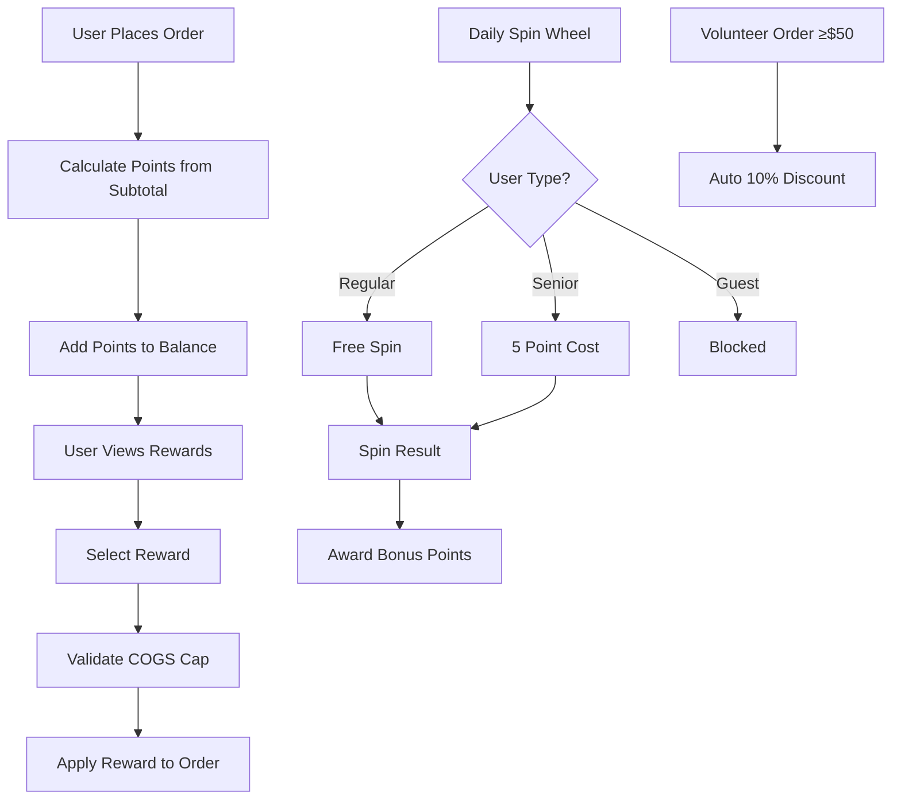

# Broski's Rewards Backend - Product Requirements Document

## 1. Product Overview

Broski's Rewards is a customer loyalty system designed to drive repeat business while maintaining strict profit margins through controlled reward distribution and point economics.

The system enforces a 1 point = $0.10 spend ratio with COGS-capped rewards, spin wheel mechanics for engagement, and tiered benefits for special customer segments. Target average giveback is ≤8% with jackpot hit rates ≤2% to ensure profitability.

## 2. Core Features

### 2.1 User Roles

| Role | Registration Method | Core Permissions |
|------|---------------------|------------------|
| Guest User | No registration required | Cannot earn points or spin wheel |
| Regular User | Email/phone registration | Earn points, redeem rewards, 1 spin/24h |
| Senior User | Regular user + age verification flag | Earn points, redeem rewards, spin costs 5pts instead of standard |
| Volunteer User | Regular user + volunteer status flag | Earn points, redeem rewards, auto 10% off orders ≥$50 |
| Admin/Manager | Internal system access | Full system management, analytics access |

### 2.2 Feature Module

Our rewards system consists of the following main components:

1. **Points Management**: Point accrual, expiry tracking, balance management
2. **Reward Catalog**: Fixed rewards, percentage discounts, merchandise items
3. **Spin Wheel System**: Daily spin mechanics, jackpot distribution, point rewards
4. **Redemption Engine**: Reward validation, COGS checking, order application
5. **User Tier Management**: Senior and volunteer benefit processing
6. **Analytics Dashboard**: Giveback tracking, profit margin monitoring

### 2.3 Page Details

| Page Name | Module Name | Feature description |
|-----------|-------------|---------------------|
| Points Management | Point Accrual | Calculate points from order subtotal (floor(subtotal * 0.1)), exclude tax/tips/delivery |
| Points Management | Point Expiry | Track 30-day expiration, nightly cleanup job for expired points |
| Points Management | Balance Display | Show current points, pending points, expiration dates |
| Reward Catalog | Fixed Rewards | 100pts=Free Side($2 COGS), 150pts=Free Dessert($4), 500pts=Free Burger($6) |
| Reward Catalog | Percentage Discounts | 300pts=10% Off, 700pts=20% Off (food subtotal only) |
| Reward Catalog | Merchandise | 400pts=Hat($8), 600pts=Shirt($12), 1000pts=Cookbook($20) |
| Spin Wheel System | Daily Spin | 1 spin per 24h, costs points for seniors (5pts), blocked for guests |
| Spin Wheel System | Reward Distribution | 5, 10, 20, 25 point rewards, 50pt jackpot (≤2% chance) |
| Redemption Engine | COGS Validation | Block redemptions if item exceeds maximum cost caps |
| Redemption Engine | Order Application | Apply one reward per order, percentage discounts after fixed rewards |
| User Tier Management | Senior Benefits | 5 points = 1 spin instead of standard cost |
| User Tier Management | Volunteer Benefits | Auto 10% discount on orders ≥$50, no stacking with other discounts |
| Analytics Dashboard | Giveback Tracking | Monitor average giveback percentage (target ≤8%) |
| Analytics Dashboard | Jackpot Monitoring | Track jackpot hit rate (target ≤2%) |

## 3. Core Process

**Regular User Flow:**
1. User places order → Points calculated from subtotal → Points added to balance
2. User accesses rewards → Views available rewards based on point balance
3. User redeems reward → System validates COGS and applies to order
4. User spins wheel (once per 24h) → Receives bonus points

**Senior User Flow:**
1. Same as regular user for earning and redemption
2. Spin wheel costs 5 points instead of being free

**Volunteer User Flow:**
1. Same as regular user for earning and redemption
2. Orders ≥$50 automatically receive 10% discount (no stacking)

## 4. User Interface Design

### 4.1 Design Style

- **Primary Colors**: Broski's brand orange (#FF6B35), dark charcoal (#2C3E50)
- **Secondary Colors**: Light gray (#F8F9FA), success green (#28A745), warning amber (#FFC107)
- **Button Style**: Rounded corners (8px), gradient effects for primary actions
- **Font**: Inter or system font, 16px base size, 14px for secondary text
- **Layout Style**: Card-based design with clear hierarchy, mobile-first responsive
- **Icons**: Outlined style icons, reward-themed (trophy, star, gift)

### 4.2 Page Design Overview

| Page Name | Module Name | UI Elements |
|-----------|-------------|-------------|
| Points Management | Balance Display | Large point counter, progress bars for next reward, expiration warnings |
| Reward Catalog | Reward Grid | Card layout with images, point costs, COGS indicators, "Redeem" buttons |
| Spin Wheel System | Wheel Interface | Animated wheel with color-coded segments, spin button, result animation |
| Redemption Engine | Checkout Integration | Reward selection dropdown, discount preview, terms display |
| Analytics Dashboard | Metrics Display | Charts for giveback trends, KPI cards, alert indicators |

### 4.3 Responsiveness

Mobile-first design with touch-optimized spin wheel interaction. Desktop version includes expanded analytics views for admin users. Progressive enhancement for advanced features.

## 5. Business Rules & Constraints

### 5.1 Point Economics
- 1 point = $0.10 customer spend
- Points calculated on order subtotal only (exclude tax, tips, delivery)
- Points expire 30 days after earning date
- No fractional points (use floor function)

### 5.2 Reward Constraints
- Maximum one reward per order
- COGS caps strictly enforced
- Percentage discounts apply after fixed rewards
- Exclude alcohol, gift cards, delivery fees from discounts

### 5.3 Spin Wheel Rules
- Points-only rewards (no free meals)
- 24-hour cooldown between spins
- Jackpot probability ≤2%
- Seniors pay 5 points per spin
- Guests cannot access spin wheel

### 5.4 Tier Benefits
- Volunteer discounts don't stack with other offers
- Senior spin cost reduction is automatic
- Tier status requires manual flagging in admin system

### 5.5 System Guardrails
- Target average giveback ≤8%
- Idempotency keys required for all redemption APIs
- Real-time COGS validation
- Automated point expiry cleanup