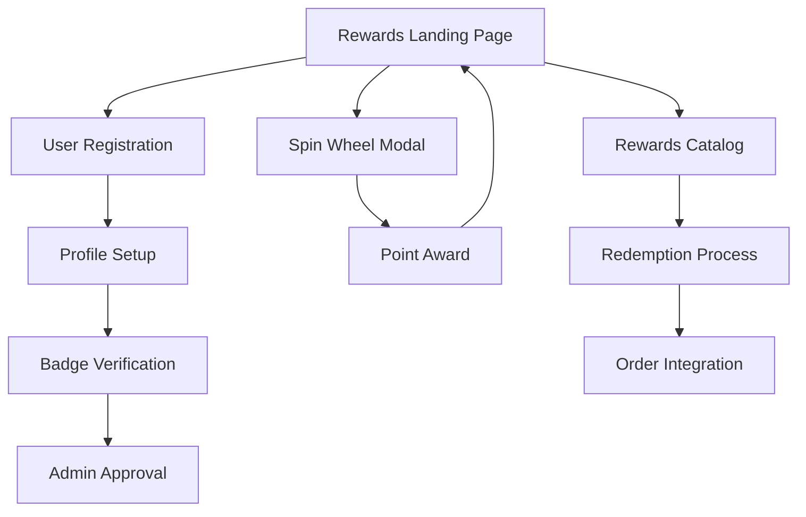

# Broski's Rewards System Redesign - Product Requirements Document

## 1. Product Overview

Broski's Rewards is a profit-optimized loyalty program that transforms customer spending into strategic engagement through points accrual, spin-to-win mechanics, and tiered rewards. The system enforces strict profit margins while delivering a premium street-luxury experience that reflects Broski's brand identity.

The redesigned system addresses profitability concerns by capping reward values at 10% of customer spend, implementing 30-day point expiry, and focusing on bonus points rather than free meals through the spin wheel mechanism.

## 2. Core Features

### 2.1 User Roles

| Role | Registration Method | Core Permissions |
|------|---------------------|------------------|
| Guest User | No registration required | Can view rewards page, cannot earn/redeem points |
| Registered User | Email/phone registration | Can earn points, spin wheel daily, redeem rewards |
| Senior User | Age verification (65+) | Reduced spin cost (5 pts instead of 10 pts) |
| Volunteer | Manual verification by admin | Auto 10% discount on orders ≥$50, standard rewards |
| Admin | Internal access only | Manage rewards, view analytics, handle verifications |

### 2.2 Feature Module

Our rewards system consists of the following main pages:

1. **Rewards Landing Page**: hero banner, points tracker, daily spin card, rewards grid, community section
2. **Spin Wheel Modal**: interactive wheel interface, animation effects, result display, countdown timer
3. **Rewards Catalog**: tabbed grid layout, redemption interface, point cost display, expiry notifications
4. **Profile Integration**: points history, tier status, badge display, verification forms
5. **Admin Dashboard**: reward management, user verification, analytics, point adjustments

### 2.3 Page Details

| Page Name | Module Name | Feature description |
|-----------|-------------|---------------------|
| Rewards Landing | Hero Banner | Display "Broski's Rewards: Eat. Earn. Spin. Win." with brand styling, CTA button for registration |
| Rewards Landing | Points Tracker | Show available points, expiring soon pill, progress bars to next spin and major rewards |
| Rewards Landing | Daily Spin Card | Countdown timer, spin button, last win display, eligibility status |
| Rewards Landing | Rewards Grid | Tabbed interface (Food/Discounts/Merch/Experiences), card layout with images and point costs |
| Rewards Landing | Community Section | Birthday/Anniversary spin eligibility, achievement nomination form, badge verification CTAs |
| Spin Wheel Modal | Wheel Interface | Interactive spinning wheel with 5/10/20/25 pt slices, rare 50pt jackpot with glow effect |
| Spin Wheel Modal | Animation System | Smooth easing, confetti on win, coin drop effects, jackpot sparkle pulse |
| Rewards Catalog | Category Tabs | Filter by Food, Discounts, Merch, Experiences with visual indicators |
| Rewards Catalog | Redemption Cards | Product images, point costs, COGS caps, "Redeem" buttons, 30-day expiry notes |
| Profile Integration | Points History | Transaction log, earning/redemption details, expiry tracking |
| Profile Integration | Badge System | Senior/Volunteer status display, verification forms, achievement showcase |
| Admin Dashboard | Reward Management | Create/edit rewards, set COGS caps, manage availability |
| Admin Dashboard | User Verification | Approve senior/volunteer status, handle achievement nominations |
| Admin Dashboard | Analytics | Track giveback percentage, jackpot hit rates, user engagement metrics |

## 3. Core Process

**Guest User Flow:**
Guests can browse the rewards page to understand the program benefits but cannot earn or redeem points. They see compelling CTAs to register and join the program.

**Registered User Flow:**
Users earn points automatically on qualifying orders (1 point per $0.10 spend), can spin the wheel daily for bonus points, and redeem accumulated points for rewards within the 30-day expiry window.

**Admin Flow:**
Admins manage the reward catalog, verify special user statuses, monitor system performance, and ensure profitability targets are met.

## 4. User Interface Design

### 4.1 Design Style

- **Primary Colors**: #000000 (base black), #FFD700 (gold), #40E0D0 (turquoise)
- **Secondary Colors**: White at 90% opacity for text, subtle grays for backgrounds
- **Button Style**: Gold fill with glow effects, hover states with brightness increase and scale transform
- **Typography**: Bold modern sans-serif for headers (Inter/Montserrat), clean sans-serif for body text
- **Layout Style**: Card-based design with sacred geometry background patterns at 3-5% opacity
- **Icon Style**: Geometric icons with gold accents, glowing effects for interactive elements

### 4.2 Page Design Overview

| Page Name | Module Name | UI Elements |
|-----------|-------------|-------------|
| Rewards Landing | Hero Banner | Black background with gold text, turquoise accent lines, sacred geometry overlay, glowing CTA button |
| Rewards Landing | Points Tracker | Circular progress indicators, gold point counters, red "expiring soon" pills, animated progress bars |
| Rewards Landing | Daily Spin Card | Glowing wheel preview, countdown timer with turquoise digits, disabled state styling |
| Rewards Landing | Rewards Grid | Card grid with hover effects, gold point badges, category tabs with active states |
| Spin Wheel Modal | Wheel Interface | Large spinning wheel with gold rim, glowing jackpot slice, smooth rotation animations |
| Rewards Catalog | Category Tabs | Horizontal tab navigation, active tab highlighting, smooth transitions |
| Rewards Catalog | Redemption Cards | Product images, point cost badges, redemption buttons with loading states |

### 4.3 Responsiveness

The rewards system is mobile-first with desktop enhancement. Touch interactions are optimized for the spin wheel, with haptic feedback on supported devices. The layout adapts from single-column mobile to multi-column desktop grids.

## 5. Business Rules

### 5.1 Points Accrual
- Formula: `points = floor(order_subtotal * 0.1)`
- Excludes: taxes, tips, delivery fees, alcohol, gift cards
- Minimum order: No minimum required for point earning
- Maximum points per order: No cap (naturally limited by order size)

### 5.2 Reward Thresholds
- 100 pts = Free Side (max COGS $2.00)
- 150 pts = Free Dessert (max COGS $4.00)
- 300 pts = 10% Off Food Subtotal
- 400 pts = Branded Hat (max cost $8.00)
- 500 pts = Free Burger (max COGS $6.00)
- 600 pts = Branded Shirt (max cost $12.00)
- 700 pts = 20% Off Food Subtotal
- 1000 pts = Cookbook (max cost $20.00)

### 5.3 Spin Wheel Mechanics
- Daily spin cost: 10 points (5 points for verified seniors)
- Wheel slices: 5 pts (30%), 10 pts (30%), 20 pts (25%), 25 pts (13%), 50 pts (2%)
- Cooldown: 24 hours from last spin
- Guest restriction: Must be registered to spin

### 5.4 Point Expiry
- Expiration period: 30 days from earning date
- Cleanup schedule: Nightly automated job
- Warning system: 7-day and 1-day expiry notifications
- Grace period: None (strict 30-day enforcement)

### 5.5 Guardrails
- One reward redemption per order
- Percentage discounts apply after fixed-value rewards
- No stacking of discounts
- Volunteer discounts don't stack with redeemed rewards
- Average giveback target: ≤8% of revenue
- Jackpot hit rate target: ≤2% of spins

## 6. Acceptance Criteria

### 6.1 Functional Requirements
- [ ] Points calculation matches formula exactly
- [ ] Reward COGS caps are enforced at redemption
- [ ] Spin wheel probabilities match specified percentages
- [ ] Point expiry occurs precisely at 30-day mark
- [ ] Senior users pay 5 points for spins
- [ ] Volunteer discounts trigger only on orders ≥$50
- [ ] One reward per order limitation is enforced
- [ ] Expired points cannot be redeemed

### 6.2 UI/UX Requirements
- [ ] Brand colors (#000000, #FFD700, #40E0D0) used consistently
- [ ] Sacred geometry background visible at 3-5% opacity
- [ ] Wheel animations smooth with proper easing
- [ ] Jackpot slice has distinctive glow effect
- [ ] Points tracker shows live balances
- [ ] Expiry warnings display prominently
- [ ] All CTAs link to appropriate sign-up/redemption flows
- [ ] Mobile responsiveness maintained across all components

### 6.3 Performance Requirements
- [ ] Average giveback percentage ≤8%
- [ ] Jackpot hit rate ≤2%
- [ ] Page load time <3 seconds
- [ ] Spin animation completes in 2-4 seconds
- [ ] Real-time point updates within 1 second

### 6.4 Security Requirements
- [ ] Idempotency keys prevent duplicate spins/redemptions
- [ ] User authentication required for all point operations
- [ ] Admin verification required for special status badges
- [ ] Point manipulation attempts logged and blocked