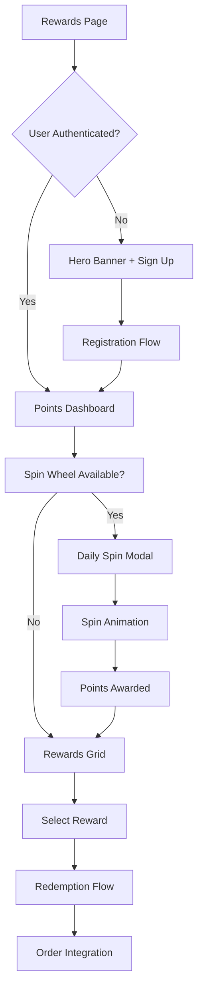

# Broski's Rewards Page Redesign - Product Requirements Document

## 1. Product Overview

Redesign the Broski's Rewards page with a street-luxury aesthetic that embodies the brand's premium cannabis kitchen identity through sophisticated visual design, interactive elements, and seamless user experience.

The redesign transforms the current basic rewards interface into an engaging, gamified experience that drives customer loyalty and repeat visits while maintaining the existing backend functionality and Firebase integration.

## 2. Core Features

### 2.1 User Roles

| Role | Registration Method | Core Permissions |
|------|---------------------|------------------|
| Guest User | No registration required | Can view rewards program overview, sign-up CTA |
| Regular Member | Email/phone registration | Can earn points, spin wheel (10 pts), redeem rewards |
| Senior Member | Age verification (65+) | Reduced spin cost (5 pts), birthday/anniversary bonuses |
| Volunteer Member | Community verification | Special badges, achievement nominations, exclusive rewards |

### 2.2 Feature Module

Our rewards page redesign consists of the following main sections:

1. **Hero Banner**: brand messaging, value proposition, primary CTA for sign-up
2. **Points Tracker Dashboard**: live balance display, expiry notifications, progress indicators
3. **Daily Spin Wheel**: interactive game modal with animated wheel and reward distribution
4. **Rewards Catalog Grid**: categorized rewards with filtering, redemption interface
5. **Community Features**: special occasion spins, achievement system, tier badges
6. **Profile Integration**: user authentication, tier status, transaction history

### 2.3 Page Details

| Page Name | Module Name | Feature description |
|-----------|-------------|---------------------|
| Rewards Page | Hero Banner | Display "Broski's Rewards: Eat. Earn. Spin. Win." title, loyalty tagline, animated background with sacred geometry, prominent [Join Broski's Rewards] CTA button |
| Rewards Page | Points Tracker | Show current available points with large typography, "expiring soon" notification pill, progress bars for spin eligibility (10 pts) and major reward thresholds (100+ pts) |
| Rewards Page | Daily Spin Card | Interactive wheel modal with 5/10/20/25/50 point segments, jackpot slice with glow effect, countdown timer for next spin availability, smooth easing animations |
| Rewards Page | Rewards Grid | Tabbed interface (Food, Discounts, Merch, Experiences), reward cards with images, point costs, "Redeem" buttons, 30-day expiry notices |
| Rewards Page | Community Section | Birthday Spin and Anniversary Spin features requiring profile dates, Achievement Nomination form with name/reason fields, Senior/Volunteer badge displays with verification CTAs |
| Rewards Page | Authentication Flow | Login/register modals, user profile integration, tier status display, transaction history access |

## 3. Core Process

**Guest User Flow:**
Guest visits rewards page → Views hero banner and program overview → Clicks "Join Broski's Rewards" → Redirected to registration → Account created → Returns to rewards dashboard

**Member Earning Flow:**
Member places order → Points automatically credited (1 pt per $10) → Notification of points earned → Points appear in tracker → Progress bars update → Spin wheel becomes available at 10 pts

**Spin Wheel Flow:**
Member has 10+ points → Clicks spin wheel → Modal opens with animated wheel → Clicks spin button → Wheel rotates with easing → Lands on segment → Confetti animation → Points awarded → Balance updates → Next spin timer starts

**Redemption Flow:**
Member browses rewards grid → Filters by category → Selects reward → Confirms redemption → Points deducted → Reward applied to next order → Confirmation displayed

## 4. User Interface Design

### 4.1 Design Style

**Color Palette:**
- Primary: #000000 (deep black base)
- Accent Gold: #FFD700 (luxury gold for CTAs and highlights)
- Accent Turquoise: #40E0D0 (energy and freshness)
- Text: rgba(255, 255, 255, 0.9) (90% white for readability)

**Typography:**
- Headers: Bold modern sans-serif (Inter Black, Montserrat Bold)
- Body: Clean sans-serif (Inter Regular, system fonts)
- Sizes: H1 (48px), H2 (32px), H3 (24px), Body (16px), Small (14px)

**Visual Elements:**
- Background: Subtle sacred geometry patterns at 3-5% opacity
- Buttons: Gold fill with glow effects, hover states with brightness increase and 1.05x scale
- Cards: Dark backgrounds with subtle borders, glass morphism effects
- Icons: Outlined style with gold/turquoise accents

**Animation Style:**
- Smooth easing curves (cubic-bezier)
- Micro-interactions on hover/click
- Particle effects for celebrations
- Smooth transitions (300ms standard)

### 4.2 Page Design Overview

| Page Name | Module Name | UI Elements |
|-----------|-------------|-------------|
| Rewards Page | Hero Banner | Full-width section with black gradient background, sacred geometry overlay at 5% opacity, centered "Broski's Rewards: Eat. Earn. Spin. Win." in 48px gold text, subtitle in 18px white, gold CTA button with glow effect |
| Rewards Page | Points Tracker | Card layout with dark background, large point display in gold (32px), small expiry pill in turquoise, horizontal progress bars with gold fill, animated counters |
| Rewards Page | Spin Wheel Modal | Centered modal with dark overlay, circular wheel with 6 segments in alternating gold/turquoise colors, jackpot segment with pulsing glow, pointer at top, spin button below |
| Rewards Page | Rewards Grid | Tab navigation in gold, 3-column grid on desktop, reward cards with image, title, point cost in gold, redeem button, hover effects with scale and glow |
| Rewards Page | Community Section | Horizontal layout with badge displays, special spin cards with countdown timers, nomination form with dark inputs and gold submit button |

### 4.3 Responsiveness

Desktop-first design with mobile-adaptive breakpoints:
- Desktop (1200px+): Full layout with 3-column grids
- Tablet (768px-1199px): 2-column grids, condensed navigation
- Mobile (320px-767px): Single column, stacked layout, touch-optimized buttons

Touch interaction optimization for mobile spin wheel with gesture support and haptic feedback where available.

## 5. Technical Requirements

### 5.1 Frontend Framework
- Next.js 14 with React 18
- TypeScript for type safety
- Tailwind CSS for styling
- Framer Motion for animations

### 5.2 Backend Integration
- Firebase Firestore for data persistence
- Existing rewards API endpoints
- Real-time updates for point balances
- Authentication via Firebase Auth

### 5.3 Performance Targets
- First Contentful Paint < 1.5s
- Largest Contentful Paint < 2.5s
- Cumulative Layout Shift < 0.1
- Time to Interactive < 3s

### 5.4 Accessibility
- WCAG 2.1 AA compliance
- Keyboard navigation support
- Screen reader compatibility
- High contrast mode support
- Focus indicators on all interactive elements

## 6. Content Strategy

### 6.1 Messaging

**Hero Section:**
- Primary: "Broski's Rewards: Eat. Earn. Spin. Win."
- Secondary: "Loyalty pays at Broski's — stack points, spin wheels, unlock surprises."
- CTA: "Join Broski's Rewards"

**Program Explanation:**
"1 point for every $10. 10 pts = spin. 100+ pts = real rewards. Points expire in 30 days—stay eating, stay winning."

**Call-to-Actions:**
- Primary: "Sign Up & Start Spinning"
- Secondary: "Redeem Now", "Spin Wheel", "View Rewards"

### 6.2 Reward Categories

**Food Rewards:**
- Free sides and appetizers (100-200 pts)
- Percentage discounts on meals (150-300 pts)
- Free entrees (400-600 pts)

**Merchandise:**
- Branded apparel and accessories (200-500 pts)
- Limited edition items (600-1000 pts)

**Experiences:**
- VIP dining experiences (800-1200 pts)
- Cannabis education sessions (500-800 pts)
- Chef meet-and-greets (1000+ pts)

## 7. Animation Specifications

### 7.1 Point Earning Animation
- Coin drop effect from top of screen
- Golden particles with physics simulation
- Counter animation with easing
- Duration: 2-3 seconds

### 7.2 Spin Wheel Animation
- Smooth rotation with cubic-bezier easing
- Deceleration over 3-4 seconds
- Confetti burst on win
- Jackpot glow with pulsing effect
- Sound effects (optional, user-controlled)

### 7.3 Micro-Interactions
- Button hover: brightness increase + 1.05x scale
- Card hover: subtle lift with shadow
- Progress bar fill: smooth animation
- Badge pulse: gentle scale animation

## 8. Success Metrics

### 8.1 Engagement Metrics
- Daily active users on rewards page
- Spin wheel usage rate
- Reward redemption conversion
- Time spent on rewards page

### 8.2 Business Metrics
- New member sign-ups
- Repeat order frequency
- Average order value increase
- Customer lifetime value improvement

### 8.3 Technical Metrics
- Page load performance
- Animation frame rate
- Error rates
- Mobile usability scores

## 9. Implementation Phases

### Phase 1: Core UI Redesign
- Hero banner implementation
- Points tracker dashboard
- Basic rewards grid
- Authentication integration

### Phase 2: Interactive Features
- Spin wheel modal and animations
- Redemption flow
- Progress indicators
- Mobile optimization

### Phase 3: Community Features
- Special occasion spins
- Achievement system
- Tier badges and verification
- Advanced animations

### Phase 4: Optimization
- Performance tuning
- A/B testing setup
- Analytics integration
- Accessibility audit

## 10. Risk Mitigation

### 10.1 Technical Risks
- Animation performance on low-end devices
- Firebase rate limiting during high traffic
- Cross-browser compatibility issues

### 10.2 User Experience Risks
- Overwhelming visual complexity
- Unclear reward value proposition
- Mobile usability challenges

### 10.3 Business Risks
- Increased reward redemption costs
- User confusion during transition
- Brand consistency concerns