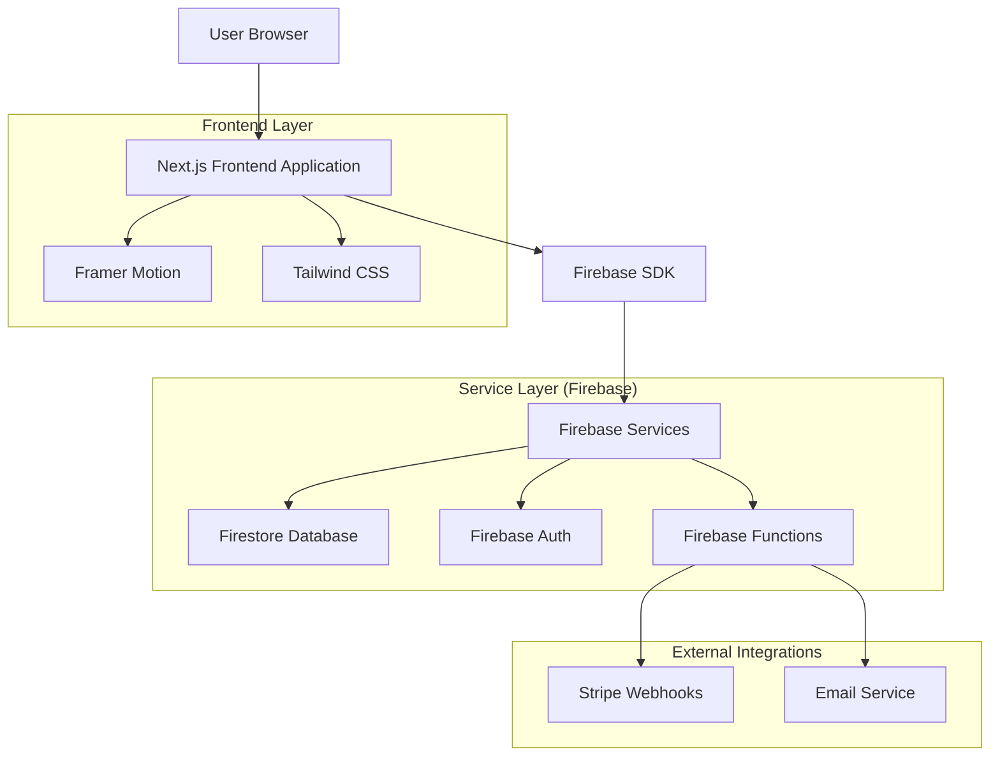
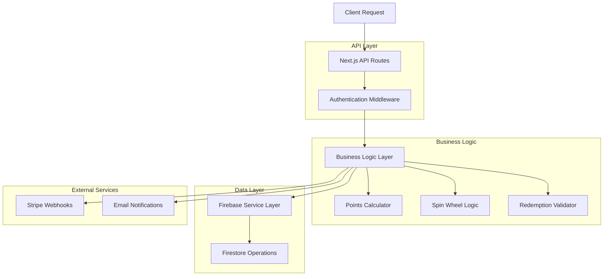
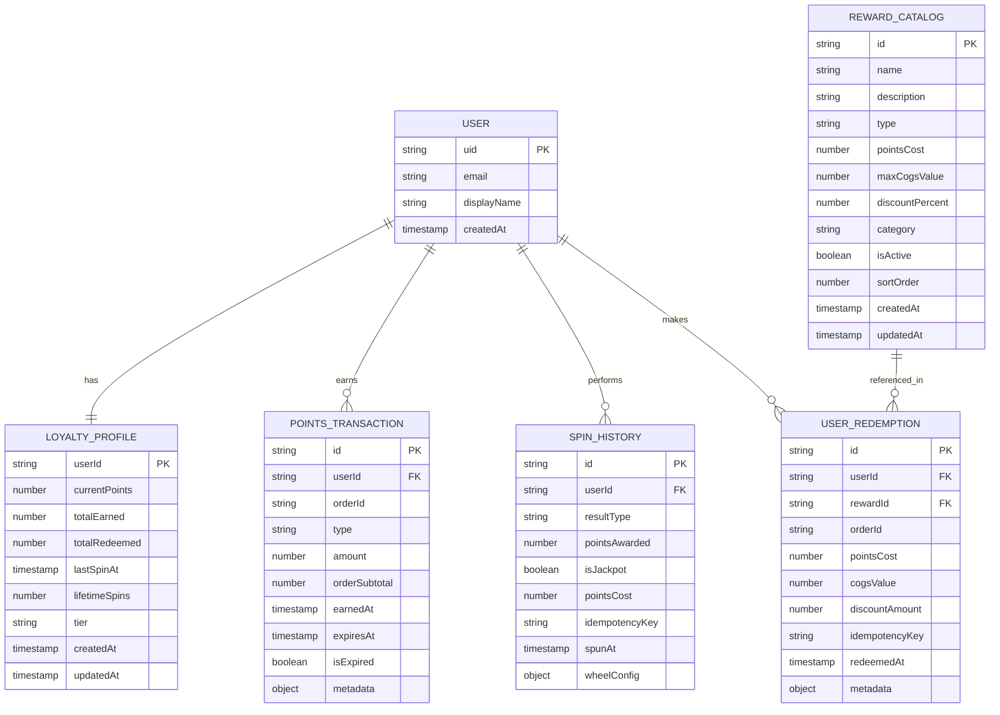

# Broski's Rewards Page Redesign - Technical Architecture Document

## 1. Architecture Design



## 2. Technology Description

* Frontend: React\@18 + Next.js\@14 + TypeScript + Tailwind CSS\@3 + Framer Motion\@10

* Backend: Firebase (Firestore, Auth, Functions)

* Database: Firebase Firestore (NoSQL)

* Authentication: Firebase Auth

* Animations: Framer Motion + CSS animations

* State Management: React Context + SWR for data fetching

## 3. Route Definitions

| Route            | Purpose                                           |
| ---------------- | ------------------------------------------------- |
| /rewards         | Main rewards page with all sections and features  |
| /auth/login      | User authentication for rewards access            |
| /auth/register   | New user registration with tier selection         |
| /profile         | User profile management and tier verification     |
| /rewards/history | Points transaction history and redemption records |

## 4. API Definitions

### 4.1 Core API

**User Balance Retrieval**

```
GET /api/rewards/balance
```

Request Headers:

| Header Name   | Type   | Required | Description       |
| ------------- | ------ | -------- | ----------------- |
| Authorization | string | true     | Firebase ID token |

Response:

| Param Name        | Param Type | Description                          |
| ----------------- | ---------- | ------------------------------------ |
| currentPoints     | number     | Available points balance             |
| expiringPoints    | array      | Points expiring within 7 days        |
| nextSpinAvailable | string     | ISO timestamp for next spin          |
| tier              | string     | User tier (regular/senior/volunteer) |

Example Response:

```json
{
  "currentPoints": 150,
  "expiringPoints": [
    {
      "amount": 25,
      "expiresAt": "2024-02-15T00:00:00Z"
    }
  ],
  "nextSpinAvailable": "2024-02-01T12:00:00Z",
  "tier": "regular"
}
```

**Spin Wheel Action**

```
POST /api/rewards/spin
```

Request:

| Param Name     | Param Type | Required | Description                           |
| -------------- | ---------- | -------- | ------------------------------------- |
| idempotencyKey | string     | true     | Unique key to prevent duplicate spins |

Response:

| Param Name        | Param Type | Description              |
| ----------------- | ---------- | ------------------------ |
| success           | boolean    | Spin operation status    |
| pointsAwarded     | number     | Points won from spin     |
| isJackpot         | boolean    | Whether jackpot was hit  |
| nextSpinAvailable | string     | Next available spin time |

Example Request:

```json
{
  "idempotencyKey": "spin_user123_20240201_120000"
}
```

Example Response:

```json
{
  "success": true,
  "pointsAwarded": 25,
  "isJackpot": false,
  "nextSpinAvailable": "2024-02-02T12:00:00Z"
}
```

**Reward Redemption**

```
POST /api/rewards/redeem
```

Request:

| Param Name     | Param Type | Required | Description               |
| -------------- | ---------- | -------- | ------------------------- |
| rewardId       | string     | true     | Catalog reward identifier |
| orderId        | string     | true     | Associated order ID       |
| idempotencyKey | string     | true     | Unique redemption key     |

Response:

| Param Name      | Param Type | Description                 |
| --------------- | ---------- | --------------------------- |
| success         | boolean    | Redemption status           |
| pointsDeducted  | number     | Points removed from balance |
| discountApplied | number     | Dollar discount amount      |
| newBalance      | number     | Updated points balance      |

**Rewards Catalog**

```
GET /api/rewards/catalog
```

Response:

| Param Name | Param Type | Description            |
| ---------- | ---------- | ---------------------- |
| rewards    | array      | Available rewards list |
| categories | array      | Reward categories      |

Example Response:

```json
{
  "rewards": [
    {
      "id": "free-side-100",
      "name": "Free Side Dish",
      "description": "Any side dish up to $8 value",
      "pointsCost": 100,
      "category": "food",
      "imageUrl": "/images/rewards/side-dish.jpg",
      "isActive": true
    }
  ],
  "categories": ["food", "discounts", "merchandise", "experiences"]
}
```

## 5. Server Architecture Diagram



## 6. Data Model

### 6.1 Data Model Definition



### 6.2 Data Definition Language

**Loyalty Profiles Collection (loyalty)**

```javascript
// Firestore collection: loyalty
// Document ID: userId (Firebase Auth UID)
{
  userId: "firebase_auth_uid",
  currentPoints: 150,
  totalEarned: 500,
  totalRedeemed: 350,
  lastSpinAt: Timestamp,
  lifetimeSpins: 12,
  tier: "regular", // regular | senior | volunteer
  createdAt: Timestamp,
  updatedAt: Timestamp
}

// Firestore security rules
rules_version = '2';
service cloud.firestore {
  match /databases/{database}/documents {
    match /loyalty/{userId} {
      allow read, write: if request.auth != null && request.auth.uid == userId;
    }
  }
}
```

**Points Transactions Collection (pointsTransactions)**

```javascript
// Firestore collection: pointsTransactions
{
  id: "auto_generated_id",
  userId: "firebase_auth_uid",
  orderId: "order_12345",
  type: "earned", // earned | redeemed | expired | bonus
  amount: 25,
  orderSubtotal: 250.00,
  earnedAt: Timestamp,
  expiresAt: Timestamp, // 30 days from earnedAt
  isExpired: false,
  metadata: {
    source: "order_purchase",
    pointsRate: 0.1
  }
}

// Composite index required
// Collection: pointsTransactions
// Fields: userId (Ascending), earnedAt (Descending)
```

**Spin History Collection (spinHistory)**

```javascript
// Firestore collection: spinHistory
{
  id: "auto_generated_id",
  userId: "firebase_auth_uid",
  resultType: "points",
  pointsAwarded: 25,
  isJackpot: false,
  pointsCost: 10, // 10 for regular, 5 for senior
  idempotencyKey: "spin_user123_20240201_120000",
  spunAt: Timestamp,
  wheelConfig: {
    segments: [5, 10, 20, 25, 50],
    probabilities: [0.3, 0.3, 0.2, 0.15, 0.05]
  }
}
```

**Reward Catalog Collection (rewardCatalog)**

```javascript
// Firestore collection: rewardCatalog
{
  id: "free-side-100",
  name: "Free Side Dish",
  description: "Any side dish up to $8 value",
  type: "fixed_item", // fixed_item | percentage_discount | merchandise
  pointsCost: 100,
  maxCogsValue: 8.00,
  discountPercent: null,
  category: "food", // food | merchandise | experiences
  imageUrl: "/images/rewards/side-dish.jpg",
  isActive: true,
  sortOrder: 1,
  createdAt: Timestamp,
  updatedAt: Timestamp
}

// Initial catalog data
const initialRewards = [
  {
    id: "free-side-100",
    name: "Free Side Dish",
    description: "Any side dish up to $8 value",
    type: "fixed_item",
    pointsCost: 100,
    maxCogsValue: 8.00,
    category: "food",
    isActive: true,
    sortOrder: 1
  },
  {
    id: "discount-15-150",
    name: "15% Off Order",
    description: "15% discount on your entire order",
    type: "percentage_discount",
    pointsCost: 150,
    discountPercent: 15,
    category: "discounts",
    isActive: true,
    sortOrder: 2
  },
  {
    id: "tshirt-300",
    name: "Broski's T-Shirt",
    description: "Premium cotton t-shirt with Broski's logo",
    type: "merchandise",
    pointsCost: 300,
    maxCogsValue: 25.00,
    category: "merchandise",
    isActive: true,
    sortOrder: 3
  }
];
```

**User Redemptions Collection (userRedemptions)**

```javascript
// Firestore collection: userRedemptions
{
  id: "auto_generated_id",
  userId: "firebase_auth_uid",
  rewardId: "free-side-100",
  orderId: "order_12345",
  pointsCost: 100,
  cogsValue: 8.00,
  discountAmount: 8.00,
  idempotencyKey: "redeem_user123_reward456_20240201",
  redeemedAt: Timestamp,
  metadata: {
    rewardName: "Free Side Dish",
    rewardType: "fixed_item"
  }
}
```

## 7. Frontend Component Architecture

### 7.1 Component Hierarchy

```
RewardsPage
├── HeroBanner
│   ├── AnimatedBackground
│   └── CTAButton
├── PointsTracker
│   ├── PointsDisplay
│   ├── ExpiryNotification
│   └── ProgressBars
├── SpinWheelModal
│   ├── WheelCanvas
│   ├── SpinButton
│   └── ConfettiAnimation
├── RewardsGrid
│   ├── CategoryTabs
│   ├── RewardCard
│   └── RedemptionModal
└── CommunitySection
    ├── SpecialSpins
    ├── AchievementForm
    └── TierBadges
```

### 7.2 State Management

```typescript
// Context providers
interface RewardsContextType {
  balance: UserBalance;
  catalog: RewardCatalog[];
  spinHistory: SpinHistory[];
  isLoading: boolean;
  error: string | null;
  refreshBalance: () => Promise<void>;
  performSpin: () => Promise<SpinResult>;
  redeemReward: (rewardId: string) => Promise<RedemptionResult>;
}

// SWR data fetching
const { data: balance, mutate: refreshBalance } = useSWR(
  user ? `/api/rewards/balance` : null,
  fetcher
);
```

### 7.3 Animation Implementation

```typescript
// Framer Motion variants
const spinWheelVariants = {
  spinning: {
    rotate: [0, 1800], // 5 full rotations
    transition: {
      duration: 3,
      ease: "easeOut"
    }
  },
  stopped: {
    rotate: 0
  }
};

const confettiVariants = {
  burst: {
    scale: [0, 1, 0],
    opacity: [0, 1, 0],
    transition: {
      duration: 2,
      ease: "easeOut"
    }
  }
};
```

## 8. Performance Optimization

### 8.1 Code Splitting

* Lazy load spin wheel modal

* Dynamic imports for heavy animations

* Route-based code splitting

### 8.2 Caching Strategy

* SWR for client-side caching

* Firebase offline persistence

* Static asset caching

### 8.3 Bundle Optimization

* Tree shaking for unused code

* Image optimization with Next.js

* CSS purging with Tailwind

## 9. Security Considerations

### 9.1 Authentication

* Firebase Auth token validation

* Secure HTTP-only cookies

* CSRF protection

### 9.2 Data Validation

* Input sanitization

* Rate limiting on API endpoints

* Idempotency key validation

### 9.3 Privacy

* GDPR compliance

* Data encryption at rest

* Minimal data collection

## 10. Deployment Strategy

### 10.1 Environment Configuration

* Development: Local Firebase emulator

* Staging: Firebase staging project

* Production: Firebase production project

### 10.2 CI/CD Pipeline

* GitHub Actions for automated testing

* Vercel deployment integration

* Firebase Functions deployment

### 10.3 Monitoring

* Firebase Analytics

* Error tracking with Sentry

* Performance monitoring

* User behavior analytics

