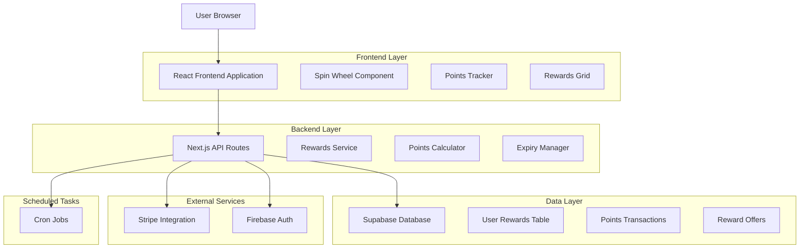
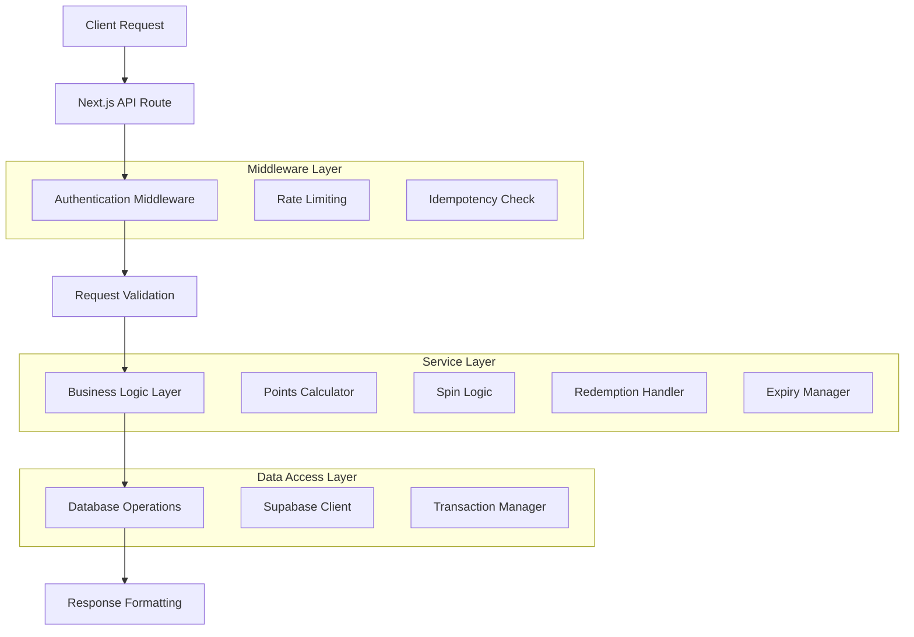
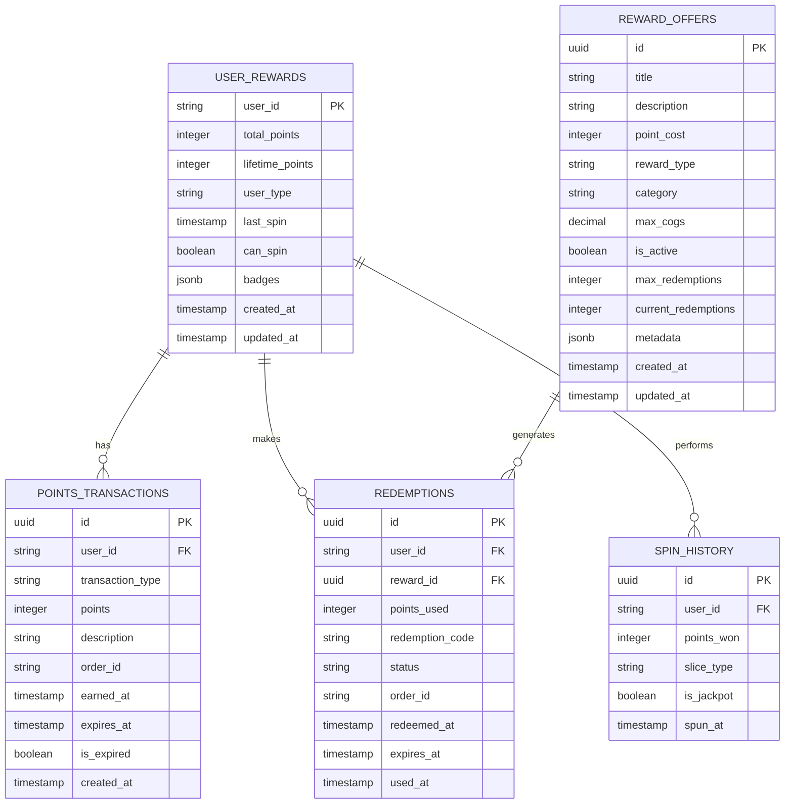

# Broski's Rewards System - Technical Architecture Document

## 1. Architecture Design



## 2. Technology Description

- **Frontend**: React@18 + Next.js@14 + TypeScript + Tailwind CSS + Framer Motion
- **Backend**: Next.js API Routes + Supabase PostgreSQL
- **Authentication**: Firebase Auth (existing integration)
- **Database**: Supabase PostgreSQL with real-time subscriptions
- **Payments**: Stripe (existing integration for order tracking)
- **Scheduling**: Vercel Cron Jobs for point expiry cleanup
- **State Management**: React Context + SWR for data fetching

## 3. Route Definitions

| Route | Purpose |
|-------|----------|
| /rewards | Main rewards landing page with all components |
| /rewards/history | User points transaction history |
| /rewards/redeem/[id] | Individual reward redemption flow |
| /admin/rewards | Admin dashboard for reward management |
| /admin/rewards/users | User verification and badge management |
| /admin/rewards/analytics | System performance and profitability metrics |

## 4. API Definitions

### 4.1 Core API

**Points Management**
```
POST /api/rewards/points/award
```

Request:
| Param Name | Param Type | isRequired | Description |
|------------|------------|------------|-------------|
| userId | string | true | User identifier |
| orderId | string | true | Order reference for points |
| orderSubtotal | number | true | Order subtotal for calculation |
| idempotencyKey | string | true | Prevent duplicate awards |

Response:
| Param Name | Param Type | Description |
|------------|------------|-------------|
| success | boolean | Operation status |
| pointsAwarded | number | Points added to user account |
| newBalance | number | Updated point balance |
| expiryDate | string | When these points expire |

Example:
```json
{
  "userId": "user_123",
  "orderId": "BK-1234567890",
  "orderSubtotal": 25.50,
  "idempotencyKey": "order_BK-1234567890_points"
}
```

**Spin Wheel**
```
POST /api/rewards/spin
```

Request:
| Param Name | Param Type | isRequired | Description |
|------------|------------|------------|-------------|
| userId | string | true | User identifier |
| idempotencyKey | string | true | Prevent duplicate spins |

Response:
| Param Name | Param Type | Description |
|------------|------------|-------------|
| success | boolean | Spin operation status |
| result | object | Spin result details |
| pointsWon | number | Points awarded from spin |
| nextSpinAvailable | string | Timestamp for next spin |
| newBalance | number | Updated point balance |

Example:
```json
{
  "success": true,
  "result": {
    "slice": "jackpot",
    "points": 50,
    "isJackpot": true
  },
  "pointsWon": 50,
  "nextSpinAvailable": "2024-01-16T10:30:00Z",
  "newBalance": 275
}
```

**Reward Redemption**
```
POST /api/rewards/redeem
```

Request:
| Param Name | Param Type | isRequired | Description |
|------------|------------|------------|-------------|
| userId | string | true | User identifier |
| rewardId | string | true | Reward to redeem |
| idempotencyKey | string | true | Prevent duplicate redemptions |

Response:
| Param Name | Param Type | Description |
|------------|------------|-------------|
| success | boolean | Redemption status |
| redemptionCode | string | Code for order application |
| pointsDeducted | number | Points removed from account |
| newBalance | number | Updated point balance |
| expiryDate | string | When redemption expires |

**User Rewards Status**
```
GET /api/rewards/status
```

Response:
| Param Name | Param Type | Description |
|------------|------------|-------------|
| userId | string | User identifier |
| totalPoints | number | Current point balance |
| expiringPoints | number | Points expiring in 7 days |
| lastSpin | string | Last spin timestamp |
| canSpin | boolean | Spin availability status |
| userType | string | regular/senior/volunteer |
| badges | array | User achievement badges |

## 5. Server Architecture Diagram



## 6. Data Model

### 6.1 Data Model Definition



### 6.2 Data Definition Language

**User Rewards Table**
```sql
-- Create user_rewards table
CREATE TABLE user_rewards (
    user_id VARCHAR(255) PRIMARY KEY,
    total_points INTEGER DEFAULT 0 CHECK (total_points >= 0),
    lifetime_points INTEGER DEFAULT 0 CHECK (lifetime_points >= 0),
    user_type VARCHAR(20) DEFAULT 'regular' CHECK (user_type IN ('regular', 'senior', 'volunteer')),
    last_spin TIMESTAMP WITH TIME ZONE,
    can_spin BOOLEAN DEFAULT true,
    badges JSONB DEFAULT '[]'::jsonb,
    created_at TIMESTAMP WITH TIME ZONE DEFAULT NOW(),
    updated_at TIMESTAMP WITH TIME ZONE DEFAULT NOW()
);

-- Create indexes
CREATE INDEX idx_user_rewards_user_type ON user_rewards(user_type);
CREATE INDEX idx_user_rewards_last_spin ON user_rewards(last_spin);

-- Row Level Security
ALTER TABLE user_rewards ENABLE ROW LEVEL SECURITY;
CREATE POLICY "Users can view own rewards" ON user_rewards FOR SELECT USING (auth.uid()::text = user_id);
CREATE POLICY "Users can update own rewards" ON user_rewards FOR UPDATE USING (auth.uid()::text = user_id);

-- Grant permissions
GRANT SELECT ON user_rewards TO anon;
GRANT ALL PRIVILEGES ON user_rewards TO authenticated;
```

**Points Transactions Table**
```sql
-- Create points_transactions table
CREATE TABLE points_transactions (
    id UUID PRIMARY KEY DEFAULT gen_random_uuid(),
    user_id VARCHAR(255) NOT NULL,
    transaction_type VARCHAR(20) NOT NULL CHECK (transaction_type IN ('earned', 'redeemed', 'expired', 'bonus', 'adjusted')),
    points INTEGER NOT NULL,
    description TEXT NOT NULL,
    order_id VARCHAR(255),
    earned_at TIMESTAMP WITH TIME ZONE DEFAULT NOW(),
    expires_at TIMESTAMP WITH TIME ZONE,
    is_expired BOOLEAN DEFAULT false,
    created_at TIMESTAMP WITH TIME ZONE DEFAULT NOW()
);

-- Create indexes
CREATE INDEX idx_points_transactions_user_id ON points_transactions(user_id);
CREATE INDEX idx_points_transactions_expires_at ON points_transactions(expires_at) WHERE expires_at IS NOT NULL;
CREATE INDEX idx_points_transactions_is_expired ON points_transactions(is_expired);
CREATE INDEX idx_points_transactions_order_id ON points_transactions(order_id) WHERE order_id IS NOT NULL;

-- Row Level Security
ALTER TABLE points_transactions ENABLE ROW LEVEL SECURITY;
CREATE POLICY "Users can view own transactions" ON points_transactions FOR SELECT USING (auth.uid()::text = user_id);

-- Grant permissions
GRANT SELECT ON points_transactions TO anon;
GRANT ALL PRIVILEGES ON points_transactions TO authenticated;
```

**Reward Offers Table**
```sql
-- Create reward_offers table
CREATE TABLE reward_offers (
    id UUID PRIMARY KEY DEFAULT gen_random_uuid(),
    title VARCHAR(255) NOT NULL,
    description TEXT NOT NULL,
    point_cost INTEGER NOT NULL CHECK (point_cost > 0),
    reward_type VARCHAR(20) NOT NULL CHECK (reward_type IN ('food', 'discount', 'merchandise', 'experience')),
    category VARCHAR(50) NOT NULL,
    max_cogs DECIMAL(10,2) CHECK (max_cogs > 0),
    is_active BOOLEAN DEFAULT true,
    max_redemptions INTEGER DEFAULT -1,
    current_redemptions INTEGER DEFAULT 0 CHECK (current_redemptions >= 0),
    metadata JSONB DEFAULT '{}'::jsonb,
    created_at TIMESTAMP WITH TIME ZONE DEFAULT NOW(),
    updated_at TIMESTAMP WITH TIME ZONE DEFAULT NOW()
);

-- Create indexes
CREATE INDEX idx_reward_offers_is_active ON reward_offers(is_active);
CREATE INDEX idx_reward_offers_reward_type ON reward_offers(reward_type);
CREATE INDEX idx_reward_offers_point_cost ON reward_offers(point_cost);

-- Grant permissions
GRANT SELECT ON reward_offers TO anon;
GRANT ALL PRIVILEGES ON reward_offers TO authenticated;
```

**Redemptions Table**
```sql
-- Create redemptions table
CREATE TABLE redemptions (
    id UUID PRIMARY KEY DEFAULT gen_random_uuid(),
    user_id VARCHAR(255) NOT NULL,
    reward_id UUID NOT NULL REFERENCES reward_offers(id),
    points_used INTEGER NOT NULL CHECK (points_used > 0),
    redemption_code VARCHAR(50) UNIQUE NOT NULL,
    status VARCHAR(20) DEFAULT 'active' CHECK (status IN ('active', 'used', 'expired')),
    order_id VARCHAR(255),
    redeemed_at TIMESTAMP WITH TIME ZONE DEFAULT NOW(),
    expires_at TIMESTAMP WITH TIME ZONE DEFAULT (NOW() + INTERVAL '30 days'),
    used_at TIMESTAMP WITH TIME ZONE
);

-- Create indexes
CREATE INDEX idx_redemptions_user_id ON redemptions(user_id);
CREATE INDEX idx_redemptions_status ON redemptions(status);
CREATE INDEX idx_redemptions_expires_at ON redemptions(expires_at);
CREATE INDEX idx_redemptions_redemption_code ON redemptions(redemption_code);

-- Row Level Security
ALTER TABLE redemptions ENABLE ROW LEVEL SECURITY;
CREATE POLICY "Users can view own redemptions" ON redemptions FOR SELECT USING (auth.uid()::text = user_id);

-- Grant permissions
GRANT SELECT ON redemptions TO anon;
GRANT ALL PRIVILEGES ON redemptions TO authenticated;
```

**Spin History Table**
```sql
-- Create spin_history table
CREATE TABLE spin_history (
    id UUID PRIMARY KEY DEFAULT gen_random_uuid(),
    user_id VARCHAR(255) NOT NULL,
    points_won INTEGER NOT NULL CHECK (points_won > 0),
    slice_type VARCHAR(20) NOT NULL CHECK (slice_type IN ('small', 'medium', 'large', 'bonus', 'jackpot')),
    is_jackpot BOOLEAN DEFAULT false,
    spun_at TIMESTAMP WITH TIME ZONE DEFAULT NOW()
);

-- Create indexes
CREATE INDEX idx_spin_history_user_id ON spin_history(user_id);
CREATE INDEX idx_spin_history_spun_at ON spin_history(spun_at DESC);
CREATE INDEX idx_spin_history_is_jackpot ON spin_history(is_jackpot) WHERE is_jackpot = true;

-- Row Level Security
ALTER TABLE spin_history ENABLE ROW LEVEL SECURITY;
CREATE POLICY "Users can view own spin history" ON spin_history FOR SELECT USING (auth.uid()::text = user_id);

-- Grant permissions
GRANT SELECT ON spin_history TO anon;
GRANT ALL PRIVILEGES ON spin_history TO authenticated;
```

**Initial Data**
```sql
-- Insert default reward offers
INSERT INTO reward_offers (title, description, point_cost, reward_type, category, max_cogs) VALUES
('Free Side', 'Choose any side from our menu', 100, 'food', 'sides', 2.00),
('Free Dessert', 'Select any dessert to satisfy your sweet tooth', 150, 'food', 'desserts', 4.00),
('10% Off Order', 'Save 10% on your food subtotal', 300, 'discount', 'percentage', NULL),
('Broski Hat', 'Official Broski''s branded hat', 400, 'merchandise', 'apparel', 8.00),
('Free Burger', 'Choose any burger from our signature menu', 500, 'food', 'entrees', 6.00),
('Broski Shirt', 'Official Broski''s branded t-shirt', 600, 'merchandise', 'apparel', 12.00),
('20% Off Order', 'Save 20% on your food subtotal', 700, 'discount', 'percentage', NULL),
('Broski Cookbook', 'Official recipe collection with signature dishes', 1000, 'merchandise', 'books', 20.00);
```

## 7. Implementation Guidelines

### 7.1 Point Calculation Logic
```typescript
function calculatePointsFromOrder(orderSubtotal: number): number {
  // Formula: points = floor(order_subtotal * 0.1)
  return Math.floor(orderSubtotal * 0.1);
}
```

### 7.2 Spin Wheel Probabilities
```typescript
const SPIN_WHEEL_CONFIG = {
  slices: [
    { points: 5, probability: 0.30, type: 'small' },
    { points: 10, probability: 0.30, type: 'medium' },
    { points: 20, probability: 0.25, type: 'large' },
    { points: 25, probability: 0.13, type: 'bonus' },
    { points: 50, probability: 0.02, type: 'jackpot' }
  ]
};
```

### 7.3 Expiry Management
```typescript
// Cron job for nightly point expiry cleanup
export async function cleanupExpiredPoints() {
  const expiredTransactions = await supabase
    .from('points_transactions')
    .update({ is_expired: true })
    .lt('expires_at', new Date().toISOString())
    .eq('is_expired', false);
    
  // Recalculate user point balances
  // Send expiry notifications
}
```