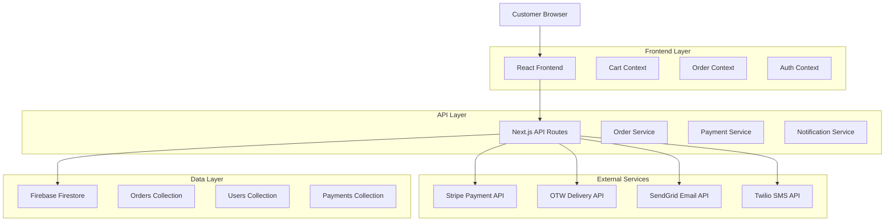
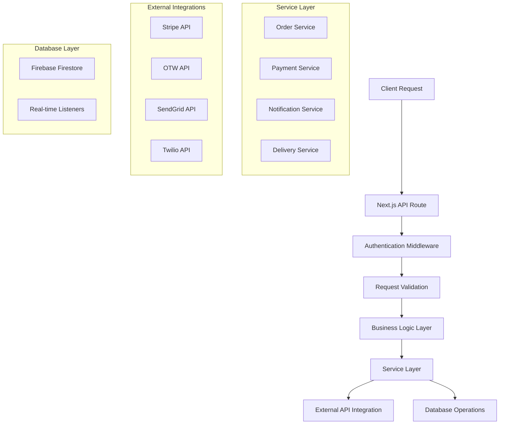
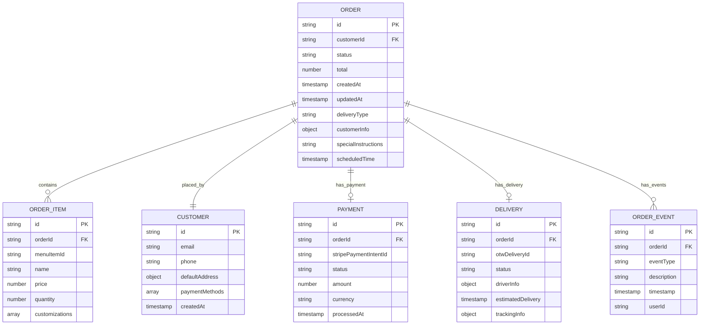

# Order System Technical Architecture

## Broski's Kitchen - Real Order Processing Implementation

## 1. Architecture Design



## 2. Technology Description

* **Frontend**: React\@18 + Next.js\@14 + TypeScript + Tailwind CSS

* **Backend**: Next.js API Routes + Node.js

* **Database**: Firebase Firestore (real-time database)

* **Payment Processing**: Stripe API + Webhooks

* **Authentication**: Firebase Auth

* **Delivery Integration**: OTW API

* **Notifications**: SendGrid (Email) + Twilio (SMS)

* **Real-time Updates**: Firebase real-time listeners

## 3. Route Definitions

| Route                               | Purpose                                                   |
| ----------------------------------- | --------------------------------------------------------- |
| `/checkout`                         | Multi-step checkout process with real payment integration |
| `/orders`                           | Customer order history and tracking                       |
| `/orders/[id]`                      | Individual order details and tracking                     |
| `/admin/orders`                     | Admin order management dashboard                          |
| `/kitchen/orders`                   | Kitchen staff order display system                        |
| `/api/orders`                       | Order CRUD operations                                     |
| `/api/stripe/create-payment-intent` | Stripe payment processing                                 |
| `/api/stripe/webhook`               | Stripe webhook handling                                   |
| `/api/otw/create-delivery`          | OTW delivery creation                                     |
| `/api/notifications/send`           | Email/SMS notification sending                            |

## 4. API Definitions

### 4.1 Order Management APIs

**Create Order**

```
POST /api/orders
```

Request:

| Param Name          | Param Type   | isRequired | Description                                |
| ------------------- | ------------ | ---------- | ------------------------------------------ |
| items               | OrderItem\[] | true       | Array of ordered items with customizations |
| customerInfo        | CustomerInfo | true       | Customer contact and delivery information  |
| paymentIntentId     | string       | true       | Stripe payment intent ID                   |
| deliveryType        | string       | true       | 'delivery' or 'pickup'                     |
| specialInstructions | string       | false      | Customer notes for the order               |
| scheduledTime       | string       | false      | ISO timestamp for scheduled orders         |

Response:

| Param Name    | Param Type | Description                                              |
| ------------- | ---------- | -------------------------------------------------------- |
| orderId       | string     | Unique order identifier                                  |
| status        | string     | Order status ('pending', 'confirmed', 'preparing', etc.) |
| estimatedTime | number     | Estimated preparation/delivery time in minutes           |
| trackingUrl   | string     | URL for order tracking                                   |

Example Request:

```json
{
  "items": [
    {
      "id": "item_123",
      "name": "Broski Burger Deluxe",
      "price": 24.99,
      "quantity": 2,
      "customizations": ["Extra cheese", "No pickles"]
    }
  ],
  "customerInfo": {
    "email": "customer@example.com",
    "phone": "+1234567890",
    "address": {
      "street": "123 Main St",
      "city": "San Francisco",
      "state": "CA",
      "zipCode": "94102"
    }
  },
  "paymentIntentId": "pi_1234567890",
  "deliveryType": "delivery",
  "specialInstructions": "Ring doorbell twice"
}
```

**Update Order Status**

```
PATCH /api/orders/[id]
```

Request:

| Param Name    | Param Type | isRequired | Description                      |
| ------------- | ---------- | ---------- | -------------------------------- |
| status        | string     | true       | New order status                 |
| estimatedTime | number     | true       | Updated estimated time           |
| notes         | string     | false      | Internal notes for status change |

**Get Order Details**

```
GET /api/orders/[id]
```

Response:

| Param Name | Param Type    | Description                                        |
| ---------- | ------------- | -------------------------------------------------- |
| order      | Order         | Complete order object with items, status, timeline |
| timeline   | OrderEvent\[] | Array of status change events with timestamps      |
| delivery   | DeliveryInfo  | Delivery tracking information (if applicable)      |

### 4.2 Payment Processing APIs

**Create Payment Intent**

```
POST /api/stripe/create-payment-intent
```

Request:

| Param Name | Param Type | isRequired | Description                                  |
| ---------- | ---------- | ---------- | -------------------------------------------- |
| amount     | number     | true       | Total amount in cents                        |
| currency   | string     | true       | Currency code (default: 'usd')               |
| orderData  | object     | true       | Order information for metadata               |
| customerId | string     | false      | Stripe customer ID for saved payment methods |

Response:

| Param Name      | Param Type | Description                          |
| --------------- | ---------- | ------------------------------------ |
| clientSecret    | string     | Stripe client secret for frontend    |
| paymentIntentId | string     | Payment intent ID for order creation |

**Confirm Payment**

```
POST /api/stripe/confirm-payment
```

Request:

| Param Name      | Param Type | isRequired | Description              |
| --------------- | ---------- | ---------- | ------------------------ |
| paymentIntentId | string     | true       | Stripe payment intent ID |
| paymentMethodId | string     | true       | Selected payment method  |

### 4.3 Delivery Integration APIs

**Create Delivery Order**

```
POST /api/otw/create-delivery
```

Request:

| Param Name          | Param Type   | isRequired | Description                  |
| ------------------- | ------------ | ---------- | ---------------------------- |
| orderId             | string       | true       | Internal order ID            |
| pickupAddress       | Address      | true       | Restaurant pickup address    |
| deliveryAddress     | Address      | true       | Customer delivery address    |
| customerInfo        | CustomerInfo | true       | Customer contact information |
| orderValue          | number       | true       | Order total for insurance    |
| specialInstructions | string       | false      | Delivery instructions        |

Response:

| Param Name    | Param Type | Description                                |
| ------------- | ---------- | ------------------------------------------ |
| deliveryId    | string     | OTW delivery tracking ID                   |
| estimatedTime | number     | Estimated delivery time in minutes         |
| trackingUrl   | string     | OTW tracking URL                           |
| driverInfo    | object     | Driver contact information (when assigned) |

## 5. Server Architecture Diagram



## 6. Data Model

### 6.1 Data Model Definition



### 6.2 Data Definition Language

**Orders Collection**

```javascript
// Firebase Firestore Collection: orders
{
  id: string, // Auto-generated document ID
  customerId: string, // Firebase Auth UID
  orderNumber: string, // Human-readable order number (BK-YYYYMMDD-XXXX)
  status: 'pending' | 'confirmed' | 'preparing' | 'ready' | 'out_for_delivery' | 'delivered' | 'cancelled',
  items: [
    {
      id: string,
      menuItemId: string,
      name: string,
      description: string,
      price: number,
      quantity: number,
      customizations: string[],
      subtotal: number
    }
  ],
  pricing: {
    subtotal: number,
    tax: number,
    deliveryFee: number,
    tip: number,
    discount: number,
    total: number
  },
  customerInfo: {
    email: string,
    phone: string,
    name: string,
    address?: {
      street: string,
      city: string,
      state: string,
      zipCode: string,
      instructions?: string
    }
  },
  deliveryType: 'delivery' | 'pickup',
  specialInstructions?: string,
  scheduledTime?: timestamp,
  estimatedTime: number, // minutes
  paymentInfo: {
    stripePaymentIntentId: string,
    status: 'pending' | 'succeeded' | 'failed',
    amount: number,
    currency: string
  },
  deliveryInfo?: {
    otwDeliveryId?: string,
    driverInfo?: object,
    trackingUrl?: string,
    estimatedDelivery?: timestamp
  },
  timeline: [
    {
      status: string,
      timestamp: timestamp,
      description: string,
      userId?: string
    }
  ],
  createdAt: timestamp,
  updatedAt: timestamp
}
```

**Firestore Security Rules**

```javascript
rules_version = '2';
service cloud.firestore {
  match /databases/{database}/documents {
    // Orders collection
    match /orders/{orderId} {
      // Customers can read their own orders
      allow read: if request.auth != null && 
                     (resource.data.customerId == request.auth.uid ||
                      'admin' in get(/databases/$(database)/documents/users/$(request.auth.uid)).data.roles);
      
      // Only authenticated users can create orders
      allow create: if request.auth != null && 
                       request.resource.data.customerId == request.auth.uid;
      
      // Only admins and kitchen staff can update orders
      allow update: if request.auth != null && 
                       ('admin' in get(/databases/$(database)/documents/users/$(request.auth.uid)).data.roles ||
                        'kitchen' in get(/databases/$(database)/documents/users/$(request.auth.uid)).data.roles);
    }
    
    // Users collection for role management
    match /users/{userId} {
      allow read, write: if request.auth != null && request.auth.uid == userId;
      allow read: if request.auth != null && 
                     'admin' in get(/databases/$(database)/documents/users/$(request.auth.uid)).data.roles;
    }
  }
}
```

**Firestore Indexes**

```json
{
  "indexes": [
    {
      "collectionGroup": "orders",
      "queryScope": "COLLECTION",
      "fields": [
        { "fieldPath": "customerId", "order": "ASCENDING" },
        { "fieldPath": "createdAt", "order": "DESCENDING" }
      ]
    },
    {
      "collectionGroup": "orders",
      "queryScope": "COLLECTION",
      "fields": [
        { "fieldPath": "status", "order": "ASCENDING" },
        { "fieldPath": "createdAt", "order": "ASCENDING" }
      ]
    },
    {
      "collectionGroup": "orders",
      "queryScope": "COLLECTION",
      "fields": [
        { "fieldPath": "deliveryType", "order": "ASCENDING" },
        { "fieldPath": "status", "order": "ASCENDING" },
        { "fieldPath": "createdAt", "order": "ASCENDING" }
      ]
    }
  ]
}
```

## 7. Implementation Steps

### Step 1: Update Checkout Flow

1. Replace mock data in `CheckoutClient.tsx` with real API calls
2. Integrate Stripe Elements for secure payment collection
3. Implement real-time order creation and status updates
4. Add proper error handling and loading states

### Step 2: Implement Order Management

1. Create real-time order dashboard for admins
2. Build kitchen display system with order queue
3. Implement order status update functionality
4. Add order search and filtering capabilities

### Step 3: Notification System

1. Set up email templates for order confirmations
2. Implement SMS notifications for order updates
3. Create real-time push notifications for status changes
4. Add notification preferences management

### Step 4: Delivery Integration

1. Integrate OTW API for delivery order creation
2. Implement real-time delivery tracking
3. Add driver communication features
4. Handle delivery status updates and notifications

This architecture provides a robust foundation for real order processing while leveraging existing infrastructure and ensuring scalability for future growth.
